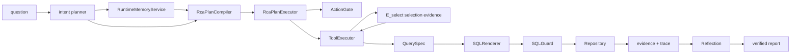

# MetricRCA

MetricRCA is a persisted-artifact metric root-cause analysis system. The LLM is
required for structured intent parsing, while plan compilation, SQL generation, SQL guard,
evidence persistence, attribution, Reflection, report projection, UI display,
and eval scoring stay deterministic and auditable.

完整项目介绍、架构流程与端到端闭环证据见 [`项目介绍.md`](项目介绍.md)。

## Quick Start

```bash
uv venv .venv && uv pip install -e .
PATH=.venv/bin:$PATH make up
PATH=.venv/bin:$PATH make seed
PATH=.venv/bin:$PATH make api
PATH=.venv/bin:$PATH make ui
PATH=.venv/bin:$PATH make eval
```

Use the same shell for LLM-backed commands and set `OPENAI_API_KEY`, or set
`METRIC_RCA_LLM_PROVIDER`, `METRIC_RCA_LLM_MODEL`, and
`METRIC_RCA_LLM_API_KEY` explicitly. Missing required LLM credentials fail with
`LLM_REQUIRED_UNAVAILABLE`.

## Architecture



- `metric_definition` and schema metadata are read through repository-backed
  services, not runtime constants.
- The only metric-fact data path is
  `QuerySpec -> SQLRenderer -> SQLGuard -> MetricRepository.execute_plan`.
- `RunService` owns run creation, intent parsing, plan compilation, deterministic
  plan execution, Reflection, report projection, tasks, token trace flushing,
  and terminal status.
- `RcaPlanCompiler` routes from structured `ParsedIntent.metric_id` and
  metadata/policy into `gmv_family` or `rate_family` plans. The model does not
  choose SQL, evidence ids, or final root cause.
- Broad discovery compiles first-class `select_signal_element` actions that
  persist `E_select_*` evidence before `fetch_related_signal` and
  `calculate_contribution`. Explicit slice questions do not require `E_select`.
- SQL budget is based on repository `sql_audit` deltas. Tool-declared
  `sql_count` must match the audit delta or the run fails
  `TOOL_SQL_COUNT_MISMATCH`.
- Memory can only influence planning priority. It cannot become evidence or a
  final conclusion.

### Runtime Boundary

OpenAI Agents SDK is used at the intent boundary for structured output. The RCA
loop itself is a typed deterministic `RcaPlan`: each action passes `ActionGate`,
then `ToolExecutor` injects run id and current-run evidence ids before calling
deterministic tools. No runtime path depends on the legacy agent stacks removed
during the SDK migration.

## Zero Silent Fallback

The project fails fast with typed errors. It forbids broad exception swallowing,
route-hardcoded RCA output, eval hardcoded success, LLM-written SQL/facts/root
causes, memory-derived conclusions, and report generation after failed
Reflection. Repository write retries are bounded and typed at the system-table
write boundary; retry exhaustion remains `SYSTEM_TABLE_WRITE_FAILED`.

## Commands

```bash
PATH=.venv/bin:$PATH make up
PATH=.venv/bin:$PATH make seed
PATH=.venv/bin:$PATH make seed SEED=20260610 SEED_PROFILE=regression
PATH=.venv/bin:$PATH make seed SEED_PROFILE=acceptance ALLOW_DESTRUCTIVE_SEED=true
PATH=.venv/bin:$PATH make api
PATH=.venv/bin:$PATH make ui
PATH=.venv/bin:$PATH make eval
PATH=.venv/bin:$PATH make eval-regression
PATH=.venv/bin:$PATH make eval-acceptance
PATH=.venv/bin:$PATH make eval-stream EVAL_ID=eval-example
PATH=.venv/bin:$PATH make eval-http BASE_URL=http://127.0.0.1:8000 PROVIDER=openai MODEL=gpt-5-nano HTTP_CONCURRENCY=5
PATH=.venv/bin:$PATH make eval-gaps EVAL_ID=eval-example
PATH=.venv/bin:$PATH make test
npm run test --prefix frontend -- --run
npm run build --prefix frontend
```

The default seed command begins with `METRIC_RCA_DATA_SEED=20260606`. The
default seed profile is `regression`. `make seed` passes
`METRIC_RCA_SEED_PROFILE` and `METRIC_RCA_ALLOW_DESTRUCTIVE_SEED` explicitly;
`acceptance` and `stress` are opt-in. Make targets map to `docker compose`,
`python`, `uvicorn`, `npm`, and `pytest` commands as defined in `Makefile`.

## API Reference

FastAPI is exposed by `metric_rca.api.main:app`.

| Method | Path | Request | Response |
|---|---|---|---|
| `GET` | `/health` | none | `{"status":"ok"}` |
| `POST` | `/api/rca/runs` | `RunCreateRequest` with `question`, optional dates, memory flags including `memory_write_on_finalize`, and per-request LLM override fields | `RunResponse` |
| `GET` | `/api/rca/runs/{run_id}` | path `run_id` | persisted `RunResponse` reconstructed from artifacts |
| `GET` | `/api/rca/runs/{run_id}/trace` | path `run_id` | `TraceResponse` |
| `GET` | `/api/rca/runs/{run_id}/evidence` | path `run_id` | `EvidenceResponse` |
| `GET` | `/api/rca/runs/{run_id}/sql-audit` | path `run_id` | `SqlAuditResponse` |
| `GET` | `/api/rca/runs/{run_id}/tasks` | path `run_id` | `TasksResponse` |
| `GET` | `/api/rca/runs/{run_id}/memory` | path `run_id` | `MemoryResponse` |
| `POST` | `/api/evals/run` | none | direct eval `EvalResponse` |
| `POST` | `/api/evals/{eval_id}/summary` | `EvalSummaryCreateRequest` | `EvalSummaryStoreResponse` |
| `POST` | `/api/evals/{eval_id}/case-results` | `EvalCaseResultCreateRequest` | `EvalCaseResultStoreResponse` |
| `GET` | `/api/evals/{eval_id}` | path `eval_id` | persisted eval `EvalResponse` |

Unified error responses use:

```json
{
  "error_code": "SYSTEM_TABLE_READ_FAILED",
  "message": "system table read failed",
  "recoverable": false,
  "retryable": false,
  "trace_step_id": null,
  "suggested_next_action": null
}
```

Representative error codes include `METRIC_NOT_FOUND`, `PARSE_FAILED`,
`ACTION_SCHEMA_INVALID`, `SQL_GUARD_REJECTED`, `SQL_EXECUTION_FAILED`,
`SYSTEM_TABLE_READ_FAILED`, `REPORT_ARTIFACT_MISSING`,
`EVAL_GROUND_TRUTH_MISSING`, `REFLECTION_REPAIR_FAILED`,
`AGENT_INVOKE_FAILED`, `LLM_REQUIRED_UNAVAILABLE`, `MEMORY_READ_FAILED`,
`MEMORY_WRITE_FAILED`, and `SYSTEM_TABLE_WRITE_FAILED`.

## UI

The separated React/Vite app in `frontend/` uses an injectable API client and
browser `fetch`, not direct backend imports. It renders question input,
conclusion/report, Top-K root causes, Adtributor candidates, evidence, SQL
audit, trace timeline, token/latency, Reflection issues, memory status, memory
layers, and eval summary panels. Set `VITE_METRIC_RCA_API_BASE_URL` when the API
is not at `http://127.0.0.1:8000`.

## Eval

- `make eval` runs the direct persisted-artifact 28-case regression eval against
  `anomaly_ground_truth`, including paired memory enabled/disabled legs.
- `make eval-regression`, `make eval-blind`, `make eval-seed-sweep`,
  `make eval-mutation`, `make eval-memory-treatment`, and
  `make eval-acceptance` expose the v3 suite target names and pass
  `METRIC_RCA_EVAL_SUITE`; full non-regression suite data and per-family gates
  are tracked in `docs/final-design/06-v3-repair-plan.md`.
- `make eval-stream EVAL_ID=...` streams case progress and writes per-case JSON
  artifacts under `eval_out/{eval_id}`.
- `make eval-http BASE_URL=... PROVIDER=openai MODEL=gpt-5-nano HTTP_CONCURRENCY=5`
  scores only through HTTP endpoints and persists eval summaries/case results
  back through API routes. Local HTTP traffic uses `httpx.Client(trust_env=False)`.
  Memory and baseline phases share the same parallel case runner; memory prepass
  sends `memory_write_on_finalize=false` to prevent inter-case pollution.
- `make eval-gaps EVAL_ID=...` compares prediction artifacts with eval results
  when the supplementary predict-then-verify tooling is used.

Summary output includes `case_total`, top-1/top-3 rates, anomaly accuracy,
evidence coverage, SQL safety, report traceability, Reflection repair status,
memory retrieval metrics, token/latency averages, `dangerous_sql_blocked`,
`no_anomaly_correct`, `llm_provider`, `llm_model`, and
`multi_agent_path_distribution`.

## Configuration

All application settings use the `METRIC_RCA_` prefix.

| Env var | Default |
|---|---|
| `METRIC_RCA_DB_DSN` | required; Makefile sets local app MySQL DSN |
| `METRIC_RCA_READONLY_DB_DSN` | required; Makefile sets local readonly MySQL DSN |
| `METRIC_RCA_TZ` | `Asia/Tokyo` |
| `METRIC_RCA_BUSINESS_TODAY` | `2026-06-06` |
| `METRIC_RCA_TARGET_DATE` | `2026-06-05` |
| `METRIC_RCA_THRESH_PCT` | `0.15` |
| `METRIC_RCA_Z_THRESH` | `2.0` |
| `METRIC_RCA_MAX_STEPS` | `8` |
| `METRIC_RCA_MAX_QUERY` | `20` |
| `METRIC_RCA_MAX_DRILLDOWN_DEPTH` | `3` |
| `METRIC_RCA_MAX_REPAIR` | `1` |
| `METRIC_RCA_STATEMENT_TIMEOUT_MS` | `3000` |
| `METRIC_RCA_LLM_ENABLED` | `true` |
| `METRIC_RCA_LLM_REQUIRED` | `true` |
| `METRIC_RCA_LLM_PROVIDER` | unset |
| `METRIC_RCA_LLM_MODEL` | unset |
| `METRIC_RCA_LLM_API_KEY` | unset; OpenAI path may read `OPENAI_API_KEY` |
| `METRIC_RCA_LLM_BASE_URL` | unset |
| `METRIC_RCA_LLM_STRUCTURED_OUTPUT_METHOD` | `json_schema` |
| `METRIC_RCA_LLM_TEMPERATURE` | `0.0` |
| `METRIC_RCA_EVAL_LLM_MAX_ATTEMPTS` | `3` |
| `METRIC_RCA_EVAL_LLM_RETRY_SECONDS` | `20.0` |
| `METRIC_RCA_EVAL_CONCURRENCY` | `1` |
| `METRIC_RCA_MULTI_AGENT_ENABLED` | `false` |
| `METRIC_RCA_ADTRIBUTOR_T_EP` | `0.67` |
| `METRIC_RCA_ADTRIBUTOR_T_EEP` | `0.10` |
| `METRIC_RCA_MEMORY_ENABLED` | `true` |
| `METRIC_RCA_MEMORY_REQUIRED` | `false` |
| `METRIC_RCA_MEMORY_WRITE_ON_FINALIZE` | `true` |
| `METRIC_RCA_MEMORY_TRUSTED_SOURCES` | `reflection_verified,system_verified` |
| `METRIC_RCA_SIGNAL_METRIC_BY_TYPE` | campaign/inventory/conversion/refund_quality mapping |
| `METRIC_RCA_ROOT_CAUSE_TYPE_BY_METRIC` | refund, conversion, stockout, complaint defaults |
| `METRIC_RCA_ROOT_CAUSE_TYPE_BY_DIMENSION` | channel/category/device/product defaults |
| `METRIC_RCA_ROOT_CAUSE_TYPE_BY_DIMENSION_ELEMENT` | `{}` |

Makefile-only variables: `SEED`, `EVAL_ID`, `BASE_URL`, `HTTP_TIMEOUT`,
`HTTP_CONCURRENCY`, `PROVIDER`, and `MODEL`.
