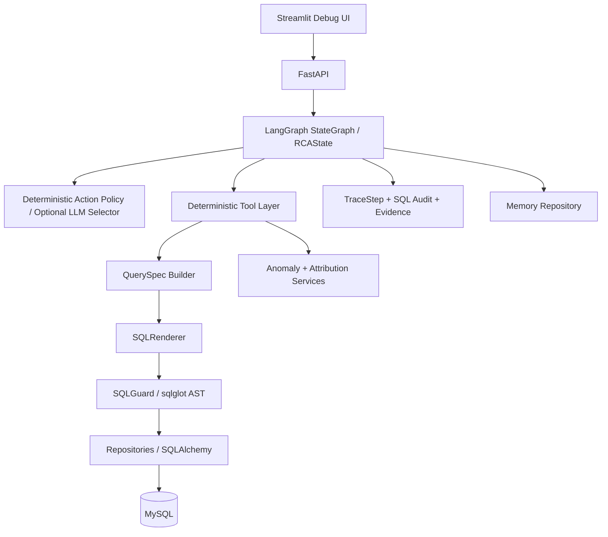
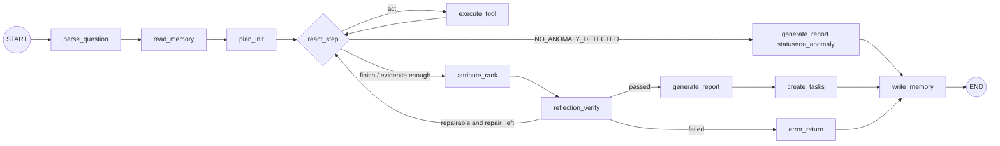

# MetricRCA Development Roadmap & Checklist

> 本文用于把 `docs/MetricRCA.md`、`docs/deep-research-report.md` 和 pasted text 中的研究结论统一成可开发的 roadmap/checklist。
> 开发时以本文和 `docs/MetricRCA.md` 为准，`docs/deep-research-report.md` 作为架构解释、README 背景和面试讲解材料。

## 0. 冻结决策

### 0.1 文档角色

| 文件 | 统一名称 | 用途 | 开发优先级 |
|---|---|---|---|
| `docs/MetricRCA.md` | MetricRCA 工程设计文档 | 系统设计、模块结构、数据结构、DDL、API、测试、3 天实现计划 | P0 |
| `docs/deep-research-report.md` | MetricRCA 研究与面试讲解稿 | 项目价值、Agent 模式、工程取舍、面试表达、扩展路线 | P2 |
| `docs/MetricRCA-roadmap-checklist.md` | MetricRCA 开发路线与验收清单 | 命名统一、缺口补齐、开发顺序、组件 checklist | P0 |

### 0.2 关键口径

| 主题 | 统一决策 |
|---|---|
| SQL 生成 | LLM 不直接生成任意 SQL；LLM/规则只产出 `AgentAction` 或 `QuerySpec`，由 `SQLRenderer` 确定性渲染，再经 `SQLGuard` 校验。 |
| 节点命名 | 代码层使用 `MetricRCA.md` 的 MVP 节点：`parse_question`、`read_memory`、`plan_init`、`react_step`、`execute_tool`、`attribute_rank`、`reflection_verify`、`generate_report`、`create_tasks`、`write_memory`、`error_return`。 |
| 研究版细节点 | `retrieve_context`、`generate_sql`、`sql_guard`、`execute_sql`、`detect_anomaly`、`drilldown`、`attribution` 等，收敛为工具层和 `react_step + execute_tool` 受控循环。 |
| 表名 | 统一使用 `fact_customer_ticket`，不要混用 `fact_ticket`。 |
| MVP 范围 | 不做 MCP、Multi-Agent、Vector DB、任意 Text-to-SQL、任意维度组合搜索、大屏、权限、多租户。 |
| Zero Fallback | 原文中的“规则兜底”统一改为“确定性主策略”。如果 LLM 是必需依赖，LLM 失败必须返回 typed error；如果 LLM 未启用，确定性策略就是主路径，不是 fallback。 |

### 0.3 MVP 固定业务边界

- 固定业务日：`business_today=2026-06-06`
- 固定目标日：`target_date=2026-06-05`
- 时区：业务事实表使用 `Asia/Tokyo` 业务本地日 `business_date DATE`；系统表时间戳使用 UTC。
- 基线：前 4 个同星期几，即 `t-7, t-14, t-21, t-28`。
- 3 天 MVP 问题族：
  - 昨天 GMV 为什么下降？
  - 昨天净 GMV 为什么下降？
  - 昨天支付转化率为什么下降？
  - 昨天退款率为什么上升？
  - 昨天某渠道 GMV 为什么异常？
  - 昨天某类目 GMV 为什么异常？
- 3 天 MVP eval case：
  - `gmv_paid_ads_drop`
  - `gmv_stockout_electronics`
  - `cvr_mobile_drop`
  - `refund_rate_product_quality`
  - `gmv_no_anomaly`

## 1. 命名统一

### 1.1 Python 包与目录

```text
metric_rca/
  api/
  agent/
  domain/
  data/
  repositories/
  guardrails/
  services/
  memory/
  evals/
  observability/
  config/
  ui/
tests/
docker-compose.yml
Makefile
README.md
```

### 1.2 业务表

```text
dim_product
dim_user
fact_order
fact_traffic
fact_inventory
fact_campaign
fact_customer_ticket
metric_definition
```

### 1.3 系统表

```text
agent_run
trace_step
evidence
sql_audit
memory_record
operation_task
anomaly_ground_truth
eval_run
eval_case_result
```

MVP 不再保留“时间不足可省略”的系统表子集。`memory_record`、`eval_run`、`eval_case_result` 都是 3 天 MVP 的可测试契约，不能因为实现压力变成未定义行为。

### 1.4 Agent 节点

| 代码节点 | 职责 | 备注 |
|---|---|---|
| `parse_question` | 解析问题、指标、日期、维度 hint | MVP 可规则解析 |
| `read_memory` | 读取 case/session 记忆 | 只能影响计划优先级 |
| `plan_init` | 初始化步数、查询数、下钻深度等运行限制 | 不做复杂 planner |
| `react_step` | 选择下一步 `AgentAction` | 确定性主策略优先，LLM 只能在白名单内选择 |
| `execute_tool` | 执行确定性工具，写 observation/evidence/trace | 不允许绕过 guardrail |
| `attribute_rank` | 聚合 evidence，产出 root cause candidates | 证据不足返回 typed error |
| `reflection_verify` | 规则校验证据、口径、数值、因果措辞 | 修复失败显式失败 |
| `generate_report` | 用 evidence 组织结构化报告 | 报告数值必须可溯源 |
| `create_tasks` | 为 confirmed/likely 主因建运营任务 | `no_anomaly` 不建任务 |
| `write_memory` | 写结构化案例记忆 | 不写大段聊天 |
| `error_return` | 结构化失败返回 | 不继续编造结果 |

### 1.5 Action 白名单

```python
ALLOWED_ACTIONS = [
    "detect_anomaly",
    "drilldown_dimension",
    "fetch_related_signal",
    "calculate_contribution",
    "finish",
]
```

非法 action 不能静默改写后继续。处理方式：

1. 写入 `Observation(ok=False, error_code="ACTION_SCHEMA_INVALID")`。
2. 如果当前采用确定性主策略，则按确定性策略重新选择下一步。
3. 如果当前配置要求 LLM 选择动作，则返回 typed error 或进入一次明确的 repair 流程。

## 2. 架构设计

### 2.1 MVP 逻辑架构



核心边界：

- 事实只来自数据库查询结果和确定性算法。
- LLM 不直接写 SQL、不直接判断事实、不直接绕过证据。
- `QuerySpec -> SQLRenderer -> SQLGuard -> Repository` 是唯一取数路径。
- 每个结论必须绑定当前 run 的 `Evidence`。
- 所有失败必须进入结构化 error/trace，不允许静默降级。

### 2.2 LangGraph 控制流



`NO_ANOMALY_DETECTED` 是显式成功分支：生成结构化 `status=no_anomaly` 报告，跳过 `attribute_rank` 和 `create_tasks`，仍写 trace/evidence/memory。不得把 no-anomaly 当成 attribution coverage failure。

运行上限：

```text
MAX_STEPS = 8
MAX_QUERY = 12
MAX_DRILLDOWN_DEPTH = 2
MAX_REPAIR = 1
```

这些是业务终止条件，不依赖 LangGraph 的 recursion limit 作为安全机制。

### 2.3 取数链路

```text
AgentAction
  -> QuerySpec
  -> SQLRenderer
  -> SQLGuard
  -> Readonly Repository
  -> rows/result_summary
  -> Evidence
  -> Observation
  -> TraceStep + sql_audit
```

维度 JOIN 策略：

- `QuerySpec` 不暴露自由 join；join 由 `MetricDefinition.allowed_dimensions` 和 `Dimension` 元数据确定性派生。
- `group_by=category` 必须由 `SQLRenderer` 渲染为 `fact_order.product_id = dim_product.product_id` 或 `fact_inventory.product_id = dim_product.product_id` 的白名单 JOIN。
- Guardrail 允许白名单 INNER JOIN，但要求每条查询至少包含一个业务事实表，并且事实表必须有 `business_date` 条件；`dim_product` 等维表本身不要求 `business_date`。
- MVP 禁止 CTE、子查询、任意 join 条件和 LLM 生成 join。

禁止链路：

```text
用户问题 -> LLM 直接写 SQL -> 执行
```

### 2.4 组件职责

| 组件 | 文件 | 输入 | 输出 | 必须测试 |
|---|---|---|---|---|
| API | `metric_rca/api/main.py`, `metric_rca/api/routes.py` | HTTP request | `run_id/status/report/error` | API schema、错误响应 |
| Agent Graph | `metric_rca/agent/graph.py`, `state.py`, `nodes/*.py` | `RCAState` | 更新后的 `RCAState` | GMV case E2E |
| Action Policy | `metric_rca/agent/react.py` | observations、limits、memory_hits | `AgentAction` | action 白名单、终止条件 |
| Tool Layer | `metric_rca/agent/tools/*.py` | `AgentAction` args | `Observation + Evidence` | 工具错误、证据绑定 |
| Guardrails | `metric_rca/guardrails/*.py` | `QuerySpec/sql` | `SQLPlan` | 危险 SQL 拦截 |
| Repositories | `metric_rca/repositories/*.py` | `SQLPlan` / system writes | rows / persisted system records | 参数化执行、只读边界 |
| Services | `metric_rca/services/*.py` | rows/evidence | anomaly/candidates/report | anomaly/attribution 单测 |
| Memory | `metric_rca/memory/memory_repo.py` | memory key/record | hits/write result | memory 不进入最终结论 |
| Observability | `metric_rca/observability/trace.py` | node/tool/sql events | trace/audit rows | trace 完整性 |
| Eval | `metric_rca/evals/*.py` | cases/ground truth | score report | no_anomaly、top1/top3 |
| UI | `metric_rca/ui/app.py` | API data | debug panels | 手动截图验收 |

## 3. 核心数据结构

### 3.1 `RCAState`

```python
from operator import add
from typing import Annotated

class RCAState(TypedDict, total=False):
    run_id: str
    question: str
    metric_id: str | None
    target_date: str
    parsed_spec: dict | None
    memory_hits: list
    actions: Annotated[list, add]
    observations: Annotated[list, add]
    evidences: Annotated[list, add]
    anomaly: dict | None
    candidates: list
    reflection: dict | None
    report: dict | None
    step_count: int
    query_count: int
    drilldown_depth: int
    repair_count: int
    error_code: str | None
    status: str
```

### 3.2 `QuerySpec`

```python
class QuerySpec(BaseModel):
    model_config = ConfigDict(extra="forbid")
    metric_id: str
    time_range: TimeRange
    group_by: list[str] = Field(default_factory=list)
    filters: dict[str, str] = Field(default_factory=dict)
    purpose: Literal["current", "baseline", "drilldown", "signal"] = "current"
    limit: int = Field(default=1000, le=5000)

    @field_validator("group_by")
    @classmethod
    def _limit_groupby(cls, v: list[str]) -> list[str]:
        if len(v) > 2:
            raise ValueError("group_by 维度数超过 MVP 上限(2)")
        return v
```

`QuerySpec` 是替代任意 Text-to-SQL 的核心契约。

### 3.3 `SQLPlan`

```python
class SQLPlan(BaseModel):
    model_config = ConfigDict(extra="forbid")
    sql: str
    sql_hash: str
    guard_status: Literal["passed", "rejected"]
    guard_errors: list[str] = []
    params: dict = {}
```

### 3.4 `Evidence`

```python
class Evidence(BaseModel):
    model_config = ConfigDict(extra="forbid")
    evidence_id: str
    query_spec: QuerySpec
    sql: str
    sql_hash: str
    guard_status: str
    result_summary: dict
    data_source: str
    created_at: datetime
```

规则：没有 `Evidence`，就不能输出确定性主因。

### 3.5 `Observation`

```python
class Observation(BaseModel):
    model_config = ConfigDict(extra="forbid")
    action_name: str
    ok: bool
    payload: dict = {}
    evidence_ids: list[str] = []
    error_code: str | None = None
    message: str | None = None
```

### 3.6 `RootCauseCandidate`

```python
class RootCauseCandidate(BaseModel):
    model_config = ConfigDict(extra="forbid")
    root_cause_type: str
    dimension: str | None = None
    element: str | None = None
    contribution_pct: float
    signal_severity: float
    evidence_support: float
    reflection_factor: float = 1.0
    eng_confidence: float
    verdict: str
    evidence_ids: list[str]
```

### 3.7 `ReflectionResult`

```python
class ReflectionResult(BaseModel):
    model_config = ConfigDict(extra="forbid")
    passed: bool
    issues: list[ReflectionIssue] = []
    repaired: bool = False
    repair_count: int = 0
```

### 3.8 `TraceStep`

```python
class TraceStep(BaseModel):
    model_config = ConfigDict(extra="forbid")
    step_id: str
    run_id: str
    seq: int
    node: str
    action: str | None = None
    input_summary: dict = {}
    output_summary: dict = {}
    error_code: str | None = None
    latency_ms: int = 0
    created_at: datetime
```

### 3.9 其他必须建模

```text
MetricId
DimensionId
RootCauseType
EvidenceVerdict
TimeRange
MetricDefinition
AgentAction
ReflectionIssue
MemoryRecord
EvalCase
AgentRun
```

所有 Pydantic 模型默认：

```python
model_config = ConfigDict(extra="forbid")
```

## 4. 数据与算法设计

### 4.1 种子数据

必须固定：

```text
SEED = 20260606
business_today = 2026-06-06
target_date = 2026-06-05
history_days = 60
```

必须生成：

- 周内效应
- 渠道分布
- 类目分布
- 投放影响
- 库存影响
- 投诉/退款影响
- `anomaly_ground_truth`

### 4.2 MVP 异常注入

| case_id | 指标 | 注入方式 | 期望主因 |
|---|---|---|---|
| `gmv_paid_ads_drop` | `gmv` | `paid_ads` spend/clicks/uv 骤降 | `campaign_traffic_drop` |
| `gmv_stockout_electronics` | `gmv` | `electronics` stockout_hours 上升 | `stockout` |
| `cvr_mobile_drop` | `pay_cvr` | `mobile` pay_user_cnt 下降 | `conversion_drop` |
| `refund_rate_product_quality` | `refund_rate` | 某商品投诉和退款激增 | `complaint_or_quality_issue` |
| `gmv_no_anomaly` | `gmv` | 不注入异常 | `no_anomaly` |

### 4.3 异常检测

```text
baseline_dates = [t-7, t-14, t-21, t-28]
baseline_mean = mean(baseline_values)
baseline_std = std(baseline_values)
delta = current - baseline_mean
delta_pct = delta / baseline_mean
z_score = delta / max(baseline_std, eps)
is_anomaly = abs(delta_pct) >= THRESH_PCT and abs(z_score) >= Z_THRESH
```

默认：

```text
THRESH_PCT = 0.15
Z_THRESH = 2.0
sample_n < 3 -> INSUFFICIENT_BASELINE_DATA
```

### 4.4 贡献归因

维度贡献：

```text
drop_by_dim[e] = max(0, baseline_value[e] - current_value[e])
contribution_pct[e] = drop_by_dim[e] / sum(drop_by_dim)
```

GMV 分解：

```text
GMV = UV * PAY_CVR * AOV
PAY_CVR = pay_user_cnt / uv
AOV = gmv / pay_user_cnt
```

主因排序：

```text
score = contribution_score * signal_severity * evidence_support * reflection_factor
eng_confidence = normalize(score)
```

`eng_confidence` 只能解释为工程置信度，不要写成统计置信度。

## 5. SQL Guardrail Checklist

必须实现：

```text
[ ] 只允许单条 SQL
[ ] 只允许 SELECT
[ ] 禁止 INSERT
[ ] 禁止 UPDATE
[ ] 禁止 DELETE
[ ] 禁止 DROP
[ ] 禁止 ALTER
[ ] 禁止 CREATE
[ ] 禁止 SELECT *
[ ] MVP 禁止 CTE / 子查询
[ ] 仅允许 renderer 生成的白名单 INNER JOIN
[ ] 表白名单
[ ] 字段白名单
[ ] 查询必须包含至少一个业务事实表
[ ] 业务事实表必须包含 business_date 条件
[ ] 强制 LIMIT
[ ] 记录 sql_hash
[ ] 写入 sql_audit
```

白名单表：

```text
fact_order
fact_traffic
fact_inventory
fact_campaign
fact_customer_ticket
dim_product
```

最小测试：

```text
[ ] SELECT * FROM fact_order WHERE business_date='2026-06-05' -> reject
[ ] SELECT order_amount FROM fact_order; DROP TABLE x -> reject
[ ] DELETE FROM fact_order -> reject
[ ] SELECT amount FROM secret_table WHERE ... -> reject
[ ] SELECT order_amount FROM fact_order -> reject
[ ] SELECT order_amount FROM fact_order WHERE business_date='2026-06-05' LIMIT 1000 -> pass
[ ] WITH x AS (...) SELECT ... -> reject
[ ] SELECT ... FROM (SELECT ...) t -> reject
[ ] renderer 生成的 fact_order JOIN dim_product category 查询 -> pass
```

## 6. Reflection Checklist

MVP Reflection 是规则校验器，不是模型长篇自评。

必须检查：

```text
[ ] 每个 RootCauseCandidate 至少绑定 1 条 Evidence
[ ] Evidence.guard_status 必须为 passed
[ ] 报告中的数值必须能在 Evidence.result_summary 中找到
[ ] evidence 的 time_range 与 target_date/baseline 一致
[ ] 指标口径一致
[ ] Top 原因贡献度达到阈值，否则 ATTRIBUTION_COVERAGE_LOW
[ ] no_anomaly case 不生成 operation_task
[ ] 证据不足时不能输出 confirmed 因果句
[ ] repair_count 不超过 MAX_REPAIR
```

修复规则：

```text
error issue with suggested_action
  -> 回 react_step
  -> 执行合法 QuerySpec
  -> 再校验
  -> 仍失败则 error_return
```

## 7. Memory Checklist

MVP 只做轻量 case/session memory，不做 Vector DB。

```text
[ ] `read_memory` 节点
[ ] `write_memory` 节点
[ ] `memory_record` 表
[ ] key 精确匹配，例如 `gmv|channel`
[ ] memory hit 只影响下钻优先级
[ ] memory 不能直接成为最终结论
[ ] 写入 confidence/source/version/ttl_days
[ ] 低置信 memory 不参与 planning
[ ] memory 失败必须显式记录 typed error；如果 memory 被配置为 required，则 run 失败
```

三层解释：

```text
working memory = RCAState
session memory = agent_run + trace_step
case memory = memory_record(layer=case)
```

## 8. API / UI / Eval

### 8.1 API

MVP 保留：

```text
POST /api/rca/runs
GET  /api/rca/runs/{run_id}
GET  /api/rca/runs/{run_id}/trace
GET  /api/rca/runs/{run_id}/evidence
POST /api/evals/run
GET  /api/evals/{eval_id}
GET  /health
```

统一错误响应：

```json
{
  "error_code": "SQL_GUARD_REJECTED",
  "message": "...",
  "recoverable": true,
  "retryable": false,
  "trace_step_id": "...",
  "suggested_next_action": "..."
}
```

### 8.2 Streamlit Debug UI

只做调试面板：

```text
[ ] 问题输入
[ ] 结论摘要
[ ] Root Cause Top-K
[ ] Evidence table
[ ] SQL audit
[ ] Trace timeline
[ ] Reflection issues
[ ] Memory hits
[ ] Eval summary
```

### 8.3 Eval

必须输出：

```text
[ ] case_total
[ ] intent_ok
[ ] anomaly_ok
[ ] top1_ok
[ ] top3_ok
[ ] evidence_coverage
[ ] sql_safe
[ ] reflection_repair_ok
[ ] dangerous_sql_blocked
[ ] no_anomaly_correct
```

字段归属：`intent_ok/anomaly_ok/top1_ok/top3_ok/evidence_coverage/sql_safe/reflection_repair_ok` 是 `eval_case_result` 逐 case 字段；`case_total/dangerous_sql_blocked/no_anomaly_correct` 和命中率汇总写入 `eval_run.summary` JSON。

验收重点：

- `gmv_no_anomaly` 必须判无异常。
- `gmv_no_anomaly` 不建 `operation_task`。
- 所有 SQL 的 `guard_status=passed`。
- 每个 confirmed/likely candidate 都有 evidence。

## 9. 分阶段 Roadmap

### 阶段 0：冻结范围

目标：30 分钟内完成开发口径冻结。

Checklist：

```text
[ ] 确认开发准绳是 `docs/MetricRCA.md`
[ ] 确认本 roadmap 是执行清单
[ ] 不再扩写研究文档
[ ] MVP 支持 6 个固定问题族
[ ] MVP eval 覆盖 5 个 case
[ ] 明确不做 MCP/Multi-Agent/Vector DB/任意 Text-to-SQL
```

### 阶段 1：数据与 SQL Guardrail

目标：DB 能建、数据能 seed、SQL 能安全执行。

必须产出：

```text
pyproject.toml
docker-compose.yml
Makefile
metric_rca/data/schema.sql
metric_rca/data/seed_data.py
metric_rca/guardrails/query_spec.py
metric_rca/guardrails/renderer.py
metric_rca/guardrails/sql_guard.py
metric_rca/config/settings.py
tests/test_guard.py
```

验收：

```text
[ ] make up
[ ] make seed
[ ] make test
[ ] seed 幂等
[ ] fact_order 有数据
[ ] fact_traffic 有数据
[ ] metric_definition 有 GMV / net_gmv / pay_cvr / refund_rate 定义
[ ] anomaly_ground_truth 有 5 条 MVP case
[ ] SQLGuard 拦截 DELETE/UPDATE/DROP/SELECT *
[ ] SQLGuard 拦截 CTE / 子查询 / 非白名单 JOIN
[ ] SQLGuard 放行合法 SELECT
[ ] SQLRenderer 支持 category 维度白名单 JOIN
```

### 阶段 2：算法服务与工具层

目标：不依赖 LLM，也能跑出 RCA 结论。

必须产出：

```text
metric_rca/services/metric_service.py
metric_rca/services/anomaly_service.py
metric_rca/services/attribution_service.py
metric_rca/agent/tools/detect_anomaly.py
metric_rca/agent/tools/drilldown_dimension.py
metric_rca/agent/tools/fetch_related_signal.py
metric_rca/agent/tools/calculate_contribution.py
tests/test_anomaly.py
tests/test_attribution.py
```

验收：

```text
[ ] paid_ads 贡献 80%+ -> campaign_traffic_drop
[ ] electronics 缺货 -> stockout
[ ] mobile 转化下降 -> conversion_drop
[ ] refund 激增 -> complaint_or_quality_issue
[ ] 所有工具返回 Observation
[ ] 所有取数工具绑定 Evidence
```

### 阶段 3：LangGraph 主流程

目标：POST 一个问题，返回完整报告。

必须产出：

```text
metric_rca/agent/state.py
metric_rca/agent/graph.py
metric_rca/agent/react.py
metric_rca/agent/nodes/parse_question.py
metric_rca/agent/nodes/read_memory.py
metric_rca/agent/nodes/plan_init.py
metric_rca/agent/nodes/react_step.py
metric_rca/agent/nodes/execute_tool.py
metric_rca/agent/nodes/attribute_rank.py
metric_rca/agent/nodes/reflection_verify.py
metric_rca/agent/nodes/generate_report.py
metric_rca/agent/nodes/create_tasks.py
metric_rca/agent/nodes/write_memory.py
metric_rca/agent/nodes/error_return.py
tests/test_graph.py
tests/test_zero_fallback.py
```

最小动作序列：

```text
detect_anomaly
drilldown_dimension(channel)
fetch_related_signal(campaign)
calculate_contribution
finish
```

验收：

```text
[ ] `gmv_paid_ads_drop` 通过图执行
[ ] 输出 `campaign_traffic_drop`
[ ] candidate 绑定 E1-E4
[ ] trace_step 每步有记录
[ ] SQL audit 每条 SQL 有记录
[ ] `gmv_no_anomaly` 走 no_anomaly 分支且不进入 attribute_rank
[ ] 工具失败重试耗尽后 run failed，不进入 attribute_rank
[ ] illegal action 写 error observation，不执行工具
[ ] Reflection passed
```

### 阶段 4：API + UI

目标：可演示、可截图、可查 trace/evidence。

必须产出：

```text
metric_rca/api/main.py
metric_rca/api/routes.py
metric_rca/ui/app.py
```

验收：

```text
[ ] POST /api/rca/runs 能创建并同步执行 run
[ ] GET /api/rca/runs/{run_id} 返回 report/candidates
[ ] GET /api/rca/runs/{run_id}/trace 返回 trace_step
[ ] GET /api/rca/runs/{run_id}/evidence 返回 evidence
[ ] GET /api/evals/{eval_id} 返回 eval summary 和 case result
[ ] UI 可展示结论、Top-K、Evidence、SQL、Trace、Reflection
```

### 阶段 5：Eval + README + 截图

目标：能提交、能解释、能防追问。

必须产出：

```text
metric_rca/evals/cases.jsonl
metric_rca/evals/runner.py
metric_rca/evals/scorer.py
README.md
docs/architecture.md
screenshots/
```

验收：

```text
[ ] make eval 输出 JSON + Markdown
[ ] 4 个异常 case top1 命中
[ ] no_anomaly 正确
[ ] no_anomaly 不建任务
[ ] SQL safety = 100%
[ ] evidence_coverage = 100% for confirmed/likely candidates
[ ] reflection_repair_ok 有正/负路径测试
[ ] README 写清楚架构和 Zero Fallback 边界
```

## 10. 今天最小提交目标

如果只能跑通一个场景，只做：

```text
昨天 GMV 为什么下降？
```

今天结束至少满足：

```text
[ ] make up 能启动 MySQL
[ ] make seed 能生成数据
[ ] test_guard.py 通过
[ ] POST /api/rca/runs 能跑 `gmv_paid_ads_drop`
[ ] 返回 `root_cause_type = campaign_traffic_drop`
[ ] 返回 `evidence_ids`
[ ] `trace_step` 有记录
[ ] README 写清楚架构
```

目标响应：

```json
{
  "summary": "2026-06-05 GMV 较基线下降，主要原因是 paid_ads 渠道投放流量下降。",
  "root_causes": [
    {
      "root_cause_type": "campaign_traffic_drop",
      "dimension": "channel",
      "element": "paid_ads",
      "contribution_pct": 0.83,
      "verdict": "confirmed",
      "evidence_ids": ["E1", "E2", "E3", "E4"]
    }
  ],
  "reflection": {
    "passed": true
  }
}
```

## 11. 不做清单

开发时不要碰：

```text
[ ] MCP Server
[ ] Multi-Agent
[ ] Vector DB
[ ] Shapley / Adtributor 复杂归因
[ ] 大屏前端
[ ] 登录权限
[ ] 多租户
[ ] 任意 Text-to-SQL
[ ] 任意维度组合搜索
[ ] LLM 自由工具调用
```

这些只进入 1-month evolution plan。

## 12. Zero Fallback 验收门

每次实现后必须检查：

```text
[ ] 没有 LLM-only bypass
[ ] 没有 mock/stub/demo production path
[ ] 没有 broad `except Exception: continue`
[ ] 没有默认 provider/config 替换
[ ] 没有空数据继续归因
[ ] required dependency failure 会返回 typed error
[ ] SQLGuard 拒绝后不能直接执行原 SQL
[ ] Reflection 失败不能硬输出 report
[ ] Memory 不能直接进入最终结论
[ ] no_anomaly 不建任务
[ ] LLM required 但不可用时返回 typed error
[ ] illegal action 记录 error observation 且不掩盖原错误
[ ] memory required 失败时 run failed
[ ] 空结果集不能继续归因
[ ] SQL execution retry 后仍失败时 run failed
```

必须落成自动化负向测试，不只是人工 checklist：

```text
[ ] tests/test_zero_fallback.py::test_llm_required_unavailable_fails
[ ] tests/test_zero_fallback.py::test_illegal_action_records_error_and_does_not_execute_tool
[ ] tests/test_zero_fallback.py::test_memory_required_read_failure_fails_run
[ ] tests/test_zero_fallback.py::test_memory_required_write_failure_fails_run
[ ] tests/test_zero_fallback.py::test_empty_result_does_not_enter_attribute_rank
[ ] tests/test_zero_fallback.py::test_sql_execution_retry_exhausted_fails_run
[ ] tests/test_zero_fallback.py::test_sql_guard_rejection_cannot_bypass_renderer
[ ] tests/test_zero_fallback.py::test_no_anomaly_skips_create_tasks
```

原文中需要修正的 fallback-like 表述：

| 原表述 | 统一写法 |
|---|---|
| LLM 不可用时退化为规则路径 | 确定性策略是 MVP 主路径；如果启用并要求 LLM，LLM 不可用返回 typed error。 |
| action 非法时规则兜底 | action 非法写入 error observation；确定性主策略可重新选择动作，但不能掩盖原错误。 |
| memory 失败 warning 继续 | 如果 memory 是 required，失败则 run 失败；如果该 run 配置为 `memory_enabled=false`，则不调用 memory。 |

## 13. 1 个月演进路线

| 周期 | 目标 | 验收 |
|---|---|---|
| Week 1 | MVP 稳定化：错误码、trace、边界测试 | 所有错误码都有结构化 response + trace |
| Week 2 | SQL/RCA 增强：净 GMV、Adtributor 风格 EP + Surprise、20 case | Top-3 准确率提升，SQL safety 100% |
| Week 3 | Reflection/Memory/Observability 增强 | memory 命中提升正确率且不污染结论 |
| Week 4 | 可选 MCP/Multi-Agent 收尾 | 开关式启用，关闭时 MVP 行为不变 |

MCP、Multi-Agent、Vector DB 都是可选增强，不是 MVP 验收条件。
