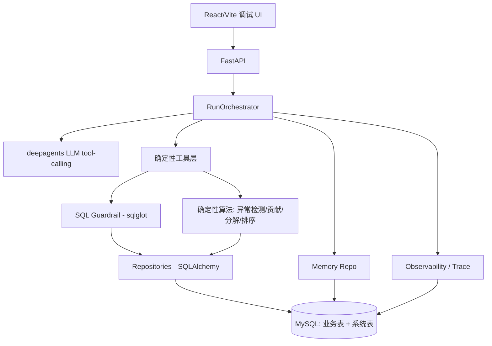
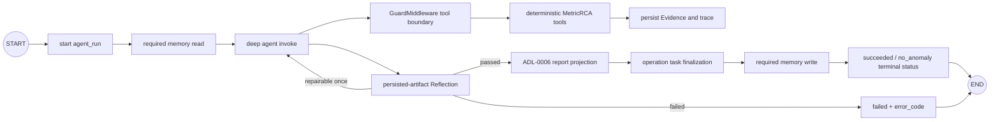
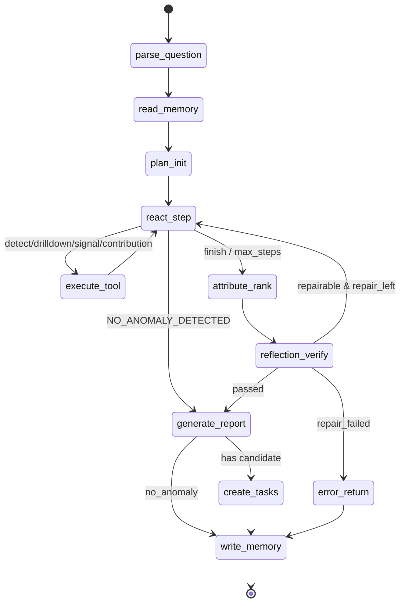

# Metric-RCA Agent：面向电商经营指标异常诊断与自动归因系统 — 系统设计文档

> 本文为工程系统设计文档（System Design Doc），面向后端 / 数据库 / 系统设计能力较强的 Python 工程师。全篇围绕「可实现、可测试、可调试」的后端工程展开。框架内部行为（LangGraph / sqlglot / Pydantic v2 / FastAPI / SQLAlchemy）均已对照官方文档 / 源码核验，并在正文标注来源。

---

## 0. Executive Summary

Metric-RCA Agent 是一个「Agentic Analytics」系统：当电商经营方观察到某经营指标异常（GMV、净 GMV、支付转化率、退款率、缺货率、投诉率等），系统自动完成「解析问题 → 安全取数 → 异常检测 → 维度下钻 → 主因定位 → 证据化 RCA 报告 → 生成运营跟进任务」。

核心设计原则：**LLM 不直接判定事实**。事实来自 MySQL 查询结果与确定性算法。LLM 仅负责：问题解析辅助、在受控动作空间内选择下一步、根据 observation 选择下钻方向、把结构化证据组织成报告文本；在 Reflection 修复阶段可提议「后续查询动作」，但该动作必须经过 schema 校验与 SQL Guardrail。

- **3 天 MVP 达成**：固定问题族（6 类）、确定性异常检测（前 4 个同星期几基线）、GMV = UV × CVR × AOV 分解、维度贡献归因、sqlglot AST SQL 守卫、ReAct 动作 / 观察循环、Reflection 校验器（规则为主）、三层 Memory（working / session / case）、证据绑定报告、5 个带 ground truth 的 eval case、trace 持久化、React/Vite 调试 UI。可通过 `make up/seed/api/ui/eval/test` 启动验证。
- **1 个月增强**：Adtributor 风格的「解释力 + Surprise」多维归因、净 GMV 链路分解、语义 / 情景 / 反思记忆与（按需）向量库、20 类异常 case 库、SQL 守卫扩展、可观测性增强、可选 MCP/Multi-Agent。

---

## 1. Goals / Non-goals

### 1.1 3 天 MVP — 做什么
- 支持固定问题族（不做任意 Text-to-SQL）：
  1. 昨天 GMV 为什么下降？
  2. 昨天净 GMV 为什么下降？
  3. 昨天支付转化率为什么下降？
  4. 昨天退款率为什么上升？
  5. 昨天某渠道 GMV 为什么异常？
  6. 昨天某类目 GMV 为什么异常？
- 固定业务日：`business_today=2026-06-06`，`target_date=2026-06-05`（昨天），时区 `Asia/Tokyo`（业务本地日），约 60 天数据。
- 基线：前 4 个同星期几（t-7, t-14, t-21, t-28）。
- P6 起动作选择由 deepagents LLM tool-calling 执行，LLM 是必需依赖；LLM 不可用必须返回 typed error，不自动改走确定性策略、其他 provider、mock、默认配置或旁路。

### 1.2 3 天 MVP — 不做什么
- 不做客服机器人、不做通用 RAG 问答、不做通用 Text-to-SQL demo、不做「用户问→模型写 SQL→返回」的薄包装、不做 BI dashboard 包装。
- 不做任意维度组合搜索（仅单维下钻 + 固定分解）。
- 不做实时流式监控、不做多租户、不做权限系统。

### 1.3 1 个月 — 做什么
- 多维归因（Adtributor 解释力 + Surprise）、净 GMV 分解、语义 / 情景 / 反思记忆、向量检索（按需）、20 类异常 case、SQL 守卫与 RCA 算法增强、可观测性增强。

### 1.4 系统边界：哪些问题不能回答 → 必须显式报错（不静默兜底）

| 场景 | 错误码 |
|---|---|
| 非白名单指标 | METRIC_NOT_FOUND |
| 不存在 / 非白名单维度 | DIMENSION_NOT_ALLOWED |
| 日期超出可用数据范围 | DATE_RANGE_INVALID |
| 请求 PII 字段 | DIMENSION_NOT_ALLOWED / QUERY_SPEC_INVALID |
| 要求执行改数 SQL | SQL_GUARD_REJECTED |
| 基线数据不足 | INSUFFICIENT_BASELINE_DATA |
| 无显著异常 | NO_ANOMALY_DETECTED |
| 多候选主因证据不足 | ATTRIBUTION_COVERAGE_LOW |
| 问题无法解析为 QuerySpec | PARSE_FAILED |
| SQL 守卫拒绝 | SQL_GUARD_REJECTED |
| 非法 action 或 args schema 校验失败 | ACTION_SCHEMA_INVALID |
| 运行配置要求 LLM 但 LLM 不可用 | LLM_REQUIRED_UNAVAILABLE |
| Memory 读失败 / 损坏 | MEMORY_READ_FAILED |
| Memory 写失败 | MEMORY_WRITE_FAILED |
| eval ground truth 缺失 | EVAL_GROUND_TRUTH_MISSING |

所有上述情况都返回结构化 error 或结构化「证据不足 / 无异常」结果，并写入 trace。

---

## 2. Domain Model（核心概念 + Pydantic v2 Schema）

> **Pydantic v2 约定（已核验官方文档 docs.pydantic.dev）**：模型继承 `BaseModel`，字段为带注解的类属性；配置用 `model_config = ConfigDict(...)`（替代 v1 的内部 `class Config`）；单字段校验用 `@field_validator`，跨字段用 `@model_validator(mode="after")` 且必须 `return self`；序列化用 `model_dump()` / `model_dump_json()`。建议核心契约模型设 `model_config = ConfigDict(extra="forbid")` 以在入口拦截非法字段。Pydantic 官方发布说明指出 **Pydantic V2 比 V1 快 5–50 倍**（校验逻辑用 Rust 重写为独立包 `pydantic-core`），因此运行时校验开销对本系统可忽略。

**实体关系（文字版）**：一次 `AgentRun` 拥有 run-scoped orchestrator context 与 persisted artifacts，产生多个 `TraceStep`、多条 `Evidence`、多个 `RootCauseCandidate`、零或多个 `ReflectionIssue`；`QuerySpec` 渲染出 `SQLPlan`，执行后产生 `Observation` 与 `Evidence`；`MemoryRecord` 在开始时被读取、结束时被写入；`EvalCase` 通过 `anomaly_ground_truth` 校验一次 `AgentRun`。

```python
# domain/enums.py
from enum import Enum

class MetricId(str, Enum):
    GMV = "gmv"
    NET_GMV = "net_gmv"
    UV = "uv"
    PAY_CVR = "pay_cvr"
    AOV = "aov"
    REFUND_RATE = "refund_rate"
    STOCKOUT_RATE = "stockout_rate"
    COMPLAINT_RATE = "complaint_rate"
    CAMPAIGN_ROI = "campaign_roi"  # 1-month

class DimensionId(str, Enum):
    CHANNEL = "channel"
    CATEGORY = "category"
    DEVICE = "device"
    WAREHOUSE = "warehouse"
    PRODUCT = "product"

class RootCauseType(str, Enum):
    CAMPAIGN_TRAFFIC_DROP = "campaign_traffic_drop"
    STOCKOUT = "stockout"
    CONVERSION_DROP = "conversion_drop"
    COMPLAINT_OR_QUALITY_ISSUE = "complaint_or_quality_issue"
    AOV_DROP = "aov_drop"
    NO_ANOMALY = "no_anomaly"

class EvidenceVerdict(str, Enum):
    CONFIRMED = "confirmed"          # 证据确认
    LIKELY = "likely"                # 可能贡献
    INSUFFICIENT = "insufficient"    # 证据不足
    RULED_OUT = "ruled_out"          # 已排除
```

```python
# domain/models.py
from datetime import date, datetime
from typing import Optional, Literal
from pydantic import BaseModel, ConfigDict, Field, field_validator

class TimeRange(BaseModel):
    model_config = ConfigDict(extra="forbid")
    start_date: date
    end_date: date
    tz: str = "Asia/Tokyo"

class MetricDefinition(BaseModel):           # 元数据：指标定义
    model_config = ConfigDict(extra="forbid")
    metric_id: str
    display_name: str
    formula: str                              # 例如 "gmv = sum(order_amount where paid=1)"
    numerator_sql_fragment: Optional[str] = None
    denominator_sql_fragment: Optional[str] = None
    higher_is_better: bool = True
    allowed_dimensions: list[str] = Field(default_factory=list)
    source_table: str
    # 1-month: aliases / business_rules

class Dimension(BaseModel):
    model_config = ConfigDict(extra="forbid")
    dim_id: str
    column: str
    table: str

class Baseline(BaseModel):
    model_config = ConfigDict(extra="forbid")
    method: Literal["prev_4_same_weekday"] = "prev_4_same_weekday"
    baseline_dates: list[date]
    baseline_mean: float
    baseline_std: float
    sample_n: int

class QuerySpec(BaseModel):                   # 受控查询规格（非自由 SQL）
    model_config = ConfigDict(extra="forbid")
    metric_id: str
    time_range: TimeRange
    group_by: list[str] = Field(default_factory=list)      # 维度列（白名单）
    filters: dict[str, str] = Field(default_factory=dict)  # 维度值过滤（白名单）
    limit: int = Field(default=1000, le=5000)
    purpose: Literal["current", "baseline", "drilldown", "signal"] = "current"

    @field_validator("group_by")
    @classmethod
    def _limit_groupby(cls, v: list[str]) -> list[str]:
        if len(v) > 2:                        # MVP：最多 2 个维度
            raise ValueError("group_by 维度数超过 MVP 上限(2)")
        return v

class ParsedIntent(BaseModel):
    model_config = ConfigDict(extra="forbid")
    metric_id: str
    target_date: date
    question_family: str
    analysis_strategy: Literal["standard", "channel_first", "product_first", "organic_first"] = "standard"
    dimension: Optional[str] = None
    element: Optional[str] = None
    filters: dict[str, str] = Field(default_factory=dict)

class SQLPlan(BaseModel):
    model_config = ConfigDict(extra="forbid")
    sql: str
    sql_hash: str                              # sha256(sql)
    guard_status: Literal["passed", "rejected"] = "rejected"
    guard_errors: list[str] = Field(default_factory=list)
    params: dict = Field(default_factory=dict)

class Evidence(BaseModel):
    model_config = ConfigDict(extra="forbid")
    evidence_id: str
    query_spec: QuerySpec
    sql: str
    sql_hash: str
    guard_status: str
    result_summary: dict                       # 结构化结果摘要（数值来源）
    data_source: str                           # 表名集合
    created_at: datetime

class Observation(BaseModel):                  # ReAct 观察
    model_config = ConfigDict(extra="forbid")
    action_name: str
    ok: bool
    payload: dict = Field(default_factory=dict)
    evidence_ids: list[str] = Field(default_factory=list)
    error_code: Optional[str] = None
    message: Optional[str] = None

class RootCauseCandidate(BaseModel):
    model_config = ConfigDict(extra="forbid")
    root_cause_type: str
    dimension: Optional[str] = None
    element: Optional[str] = None              # 维度值，如 paid_ads / electronics
    contribution_pct: float                    # 维度贡献占比
    signal_severity: float                     # 信号强度（z 或 delta 归一）
    evidence_support: float                    # 证据支持度
    reflection_factor: float = 1.0
    eng_confidence: float                      # 工程置信度（非统计置信度）
    verdict: str                               # EvidenceVerdict
    evidence_ids: list[str] = Field(default_factory=list)

class AgentAction(BaseModel):                  # ReAct 动作（LLM 输出，受控）
    model_config = ConfigDict(extra="forbid")
    action: str                                # 必须 ∈ ALLOWED_ACTIONS
    args: dict = Field(default_factory=dict)
    rationale: Optional[str] = None            # LLM 解释（仅记录，不作为事实）

class ReflectionIssue(BaseModel):
    model_config = ConfigDict(extra="forbid")
    check: str                                 # 检查项名
    severity: Literal["error", "warning"]
    by: Literal["rule", "llm"]
    message: str
    suggested_action: Optional[AgentAction] = None

class ReflectionResult(BaseModel):
    model_config = ConfigDict(extra="forbid")
    passed: bool
    issues: list[ReflectionIssue] = Field(default_factory=list)
    repaired: bool = False
    repair_count: int = 0

class MemoryRecord(BaseModel):
    model_config = ConfigDict(extra="forbid")
    memory_id: str
    layer: Literal["case", "semantic", "episodic", "reflection"]
    key: str                                   # 检索键，如 "gmv|channel"
    payload: dict
    confidence: float = 0.5
    source: str = "system"
    version: int = 1
    ttl_days: Optional[int] = None
    created_at: datetime

class EvalCase(BaseModel):
    model_config = ConfigDict(extra="forbid")
    case_id: str
    question: str
    expected_metric: str
    expected_anomaly: bool
    expected_root_cause: Optional[str] = None  # ground truth
    expected_dimension: Optional[str] = None
    expected_element: Optional[str] = None

class TraceStep(BaseModel):
    model_config = ConfigDict(extra="forbid")
    step_id: str
    run_id: str
    seq: int
    node: str
    action: Optional[str] = None
    input_summary: dict = Field(default_factory=dict)
    output_summary: dict = Field(default_factory=dict)
    error_code: Optional[str] = None
    latency_ms: int = 0
    created_at: datetime

class AgentRun(BaseModel):
    model_config = ConfigDict(extra="forbid")
    run_id: str
    question: str
    status: Literal["running", "succeeded", "no_anomaly", "failed"] = "running"
    metric_id: Optional[str] = None
    target_date: date
    error_code: Optional[str] = None
    created_at: datetime
    finished_at: Optional[datetime] = None
```

`RCAState` 是 v1 LangGraph 图状态，P6 起只保留为历史附录；当前运行态由
`RunOrchestrator`、`GuardMiddleware` 与 persisted artifacts 共同表达，见第 5 节。

**字段 MVP-必须 vs 1-month-增强标注**：`MetricDefinition.aliases / business_rules`、`MemoryRecord.layer ∈ {semantic, episodic, reflection}`、`RootCauseCandidate` 的多维组合字段均为 1-month；其余为 MVP-必须。

---

## 3. Architecture（Mermaid）

### 3.1 逻辑架构



### 3.2 控制流（P6 active）



### 3.3 数据流（详见第 15 节）

### 3.4 1 个月增强架构
新增：多维归因服务（Adtributor 解释力 + Surprise）、语义 / 情景 / 反思记忆库（可选向量库）、可观测性看板、可选 MCP server 暴露工具、可选 Multi-Agent（分诊 + 专家）。

---

## 4. Module Design（Python 包结构）

```
metric_rca/
  api/                # FastAPI 路由、请求/响应模型、依赖注入
  agent/
    runner.py         # RunOrchestrator 生命周期、repair、终态化
    factory.py        # deepagents 装配 + action-space gate
    middleware.py     # GuardMiddleware + token usage callback
    deep_tools.py     # LangChain StructuredTool wrappers
    tools/            # 确定性工具核心（QuerySpec -> Guard -> Repo）
    prompts.py        # expert system prompt
    reflection.py     # persisted-artifact Reflection 校验器
    subagents.py      # P9 multi-agent gate
  domain/             # enums, models（Pydantic）
  data/               # seed_data.py, schema.sql, anomaly_injection.py
  repositories/       # SQLAlchemy 访问层（只读取数 + 系统表写入）
  guardrails/         # sql_guard.py, query_spec.py, renderer.py
  services/           # metric_service, anomaly_service, attribution_service
  memory/             # memory_repo.py
  evals/              # cases.py, runner.py, scorer.py
  observability/      # trace.py
  config/             # settings.py (pydantic-settings)
```

各模块「职责 / 核心类 / 输入输出 / 依赖 / 3 天范围 / 1 月范围」：

- **guardrails/**：职责＝把 QuerySpec 渲染为 SQL 并经 sqlglot AST 守卫。核心：`QuerySpec`、`SQLRenderer`、`SQLGuard`。输入 QuerySpec → 输出 SQLPlan。依赖 sqlglot。3 天：单语句 SELECT、白名单、强制 LIMIT、日期条件。1 月：列级 PII 屏蔽、更多指标模板。
- **services/anomaly_service**：职责＝基线 + z-score + delta_pct 判定。3 天：前 4 同星期几。1 月：MAD / 分位、季节分解。
- **services/attribution_service**：3 天：`drop_by_dim` 贡献占比 + GMV 分解。1 月：Adtributor 解释力 + Surprise。
- **memory/**：3 天：working / session / case（MySQL 表）。1 月：semantic / episodic / reflection + 向量。
- 其余模块同理（见各专章）。

---

## 5. Agent Orchestration（v2 deepagents active design）

> **v2 source of truth**: `docs/final-design/01-architecture.md` supersedes the
> v1 hand-written `StateGraph` design for the 1-month final version. The v1
> LangGraph text is retained below as an appendix so historical MVP decisions
> remain auditable, but new implementation work must target the v2
> `RunOrchestrator + deepagents + GuardMiddleware` architecture.

P6 replaces the hand-written graph under `metric_rca/agent/` with this package
layout:

```text
metric_rca/agent/
  runner.py          # RunOrchestrator lifecycle, repair re-entry, finalization
  factory.py         # create_deep_agent assembly
  middleware.py      # GuardMiddleware via wrap_tool_call
  tools/             # LangChain @tool wrappers over deterministic tools
  prompts.py         # controlled expert prompt
  reflection.py      # persisted-artifact rule verifier
  subagents.py       # P9-only subagent config gate
```

The active control flow is:

1. `RunOrchestrator` creates `agent_run(status=running)`.
2. `factory.create_metric_rca_agent` builds a deepagents agent with the required
   LLM model, registered tool whitelist, `GuardMiddleware`, planning
   `write_todos`, and filesystem tools disabled by policy.
3. The LLM chooses among whitelisted tools only. It never writes SQL and never
   sees raw result rows.
4. `GuardMiddleware` validates each tool name and Pydantic argument schema,
   enforces run-scoped budget counters, executes the tool, writes trace, and
   fails if any data-fetching tool returns no current-run `evidence_id`.
5. After the agent loop stops, `RunOrchestrator` runs deterministic Reflection
   over persisted artifacts only. One repair re-entry is allowed through the
   same thread/checkpointer. A second failure returns
   `REFLECTION_REPAIR_FAILED` and no report.
6. `RunOrchestrator` enforces the no-anomaly contract at finalization: an
   `is_anomaly=false` evidence may only produce a `no_anomaly` run with no
   drilldown/rank trace and no operation task. Violations fail with
   `NO_ANOMALY_CONTRACT_VIOLATED`.

Hard invariants remain unchanged:

- `QuerySpec -> SQLRenderer -> SQLGuard -> Repository` is the only metric-fact
  data path.
- `MetadataRepository -> MetricService` is the only metric metadata path.
- ADL-0006 report projection remains mechanical: numeric claims must be bound
  to persisted current-run Evidence.
- Memory may influence planning priority only; memory failures are typed run
  failures when memory is required.
- Missing or unreachable LLM is `LLM_REQUIRED_UNAVAILABLE`; no deterministic
  production policy replaces the LLM.

### 5.A v1 LangGraph State Machine（superseded; kept as appendix）

> **LangGraph 核验要点（官方文档 docs.langchain.com / reference.langchain.com）**：用 `StateGraph(State)` 构建，`add_node`、`add_edge`、`add_conditional_edges(source, router, mapping)`，`START`/`END` 为特殊节点；state 可用 `TypedDict`（官方主推、零运行时开销、与 checkpoint 兼容性好）或 Pydantic `BaseModel`（带递归校验，但性能略低于 TypedDict / dataclass）；并发 / 累加字段用 `Annotated[type, reducer]`（如 `operator.add` / `add_messages`），不设 reducer 时默认「后写覆盖」；图编译 `builder.compile(checkpointer=...)`；**默认 `recursion_limit=25`**，超出抛 `GraphRecursionError`，可在 invoke 的 config 里调大 `recursion_limit`。本系统的「最大步数」由我们自身的 `max_steps` 字段控制（确定性），不依赖 recursion_limit 作为业务安全机制。
>
> **短期 / 会话记忆机制**：LangGraph 短期记忆（thread 级）通过 checkpointer（`InMemorySaver` / `SqliteSaver` / `PostgresSaver`）+ `thread_id` 持久化整张图状态；跨线程长期记忆用 `Store`。本系统的 working memory 即图状态（可选挂 checkpointer），case / semantic 等长期记忆走自建 MySQL 表（见第 8、9 节），以保证可审计与污染控制。

本系统 state 采用 `TypedDict + Annotated reducer`，契约对象内部仍用 Pydantic：

```python
# agent/state.py
from typing import Annotated, Optional, TypedDict
from operator import add

class RCAState(TypedDict, total=False):
    run_id: str
    question: str
    metric_id: Optional[str]
    target_date: str
    parsed_spec: Optional[dict]            # 解析出的意图
    memory_hits: list                      # 只影响 plan 优先级
    actions: Annotated[list, add]          # ReAct 动作历史
    observations: Annotated[list, add]     # ReAct 观察历史
    evidences: Annotated[list, add]        # Evidence 列表
    anomaly: Optional[dict]                # 异常检测结果
    candidates: list                       # RootCauseCandidate
    reflection: Optional[dict]             # ReflectionResult
    report: Optional[dict]
    step_count: int
    query_count: int
    drilldown_depth: int
    repair_count: int
    error_code: Optional[str]
    status: str
```

节点列表与读写：

| Node | 职责 | 读 state | 写 state | 失败边 |
|---|---|---|---|---|
| parse_question | 解析问题→metric_id + analysis_strategy + 维度意图 | question | parsed_spec, metric_id | PARSE_FAILED→error_return |
| read_memory | 读三层记忆，仅影响 plan | metric_id | memory_hits | MEMORY_READ_FAILED→error_return |
| plan_init | 初始化计划与最大步数 | parsed_spec | step_count=0 | — |
| react_step | 确定性主策略 / 可选 LLM 选动作 | observations,memory_hits | actions | illegal→ACTION_SCHEMA_INVALID |
| execute_tool | 确定性执行工具 | actions[-1] | observations, evidences | 工具错误→Observation(ok=False) |
| attribute_rank | 贡献+分解+排序 | evidences, anomaly | candidates | ATTRIBUTION_COVERAGE_LOW |
| reflection_verify | 校验器（规则为主） | candidates, evidences | reflection, repair_count | REFLECTION_REPAIR_FAILED |
| generate_report | 证据化报告文本（LLM 组织） | candidates, evidences | report | — |
| create_tasks | 生成运营任务 | candidates | (DB) | — |
| write_memory | 写 case / session 记忆 | report, candidates | (DB) | MEMORY_WRITE_FAILED→error_return |
| error_return | 显式错误返回 | error_code | status="failed" | — |

**条件边**：
- `react_step` 路由：若 `step_count >= MAX_STEPS` 或动作为 `finish` → `attribute_rank`；若动作为 `detect_anomaly / drilldown_dimension / fetch_related_signal / calculate_contribution` → `execute_tool`；若检测到 `NO_ANOMALY_DETECTED` → `generate_report(status=no_anomaly)` 并跳过 `attribute_rank/create_tasks`；非法动作 → 记录 `ACTION_SCHEMA_INVALID`，在不掩盖原错误的前提下走显式 repair 或 `error_return`。
- `reflection_verify` 路由：`passed` → `generate_report`；`has_error_issues and repair_count < MAX_REPAIR` → `react_step`（执行修复查询）；`repair_count >= MAX_REPAIR` → `error_return`。

**终止条件 / fail-fast 边界**：`MAX_STEPS=8`、`MAX_QUERY=12`、`MAX_DRILLDOWN_DEPTH=3`、`MAX_REPAIR=1`。任何工具失败不静默继续，而是写 Observation(ok=False)；retryable 工具最多重试 1 次，仍失败必须进入 `error_return`，不得带缺失 evidence 继续归因。



---

## 6. ReAct / Tool-Calling Design（v2 deepagents active design）

> **v2 source of truth**: P6 uses deepagents free tool-calling inside a strict
> registered action space. The v1 deterministic-primary ReAct policy is retained
> below as a superseded appendix and must not be reintroduced as a production
> fallback.

The active v2 ReAct contract is:

- The LLM is required and runs with `temperature=0`.
- The LLM client is configured through Settings only. Native OpenAI and
  OpenAI-compatible providers share the same ChatModel construction boundary:
  `llm_provider`, `llm_model`, `llm_api_key`, optional `llm_base_url`, and
  `llm_structured_output_method`. Compatible providers such as DeepSeek require
  an explicit base URL and API key; they must not silently reuse `OPENAI_API_KEY`
  or fall back to another provider/model.
- The exposed tools are exactly the MetricRCA whitelist plus deepagents
  planning `write_todos`; filesystem tools (`ls`, `read_file`, `write_file`,
  `edit_file`, and equivalents) are not part of the exposed action set.
- Each MetricRCA tool has `extra="forbid"` Pydantic input/output models.
- `GuardMiddleware.wrap_tool_call` short-circuits illegal tool names or invalid
  arguments with an `ACTION_SCHEMA_INVALID` observation and does not execute the
  tool.
- Budget counters (`max_steps`, `max_query`, `max_drilldown_depth`) live in a
  run-scoped context outside LLM-visible state. Budget exhaustion returns
  `BUDGET_EXCEEDED`; repeated illegal data-tool attempts after step/query
  exhaustion fail the run. Drilldown-depth exhaustion only blocks additional
  `drilldown_dimension` calls and does not poison later signal/contribution
  work over already persisted E2 evidence.
  A verified idempotent `drilldown_dimension` reuse of an existing matching
  E2-family Evidence does not consume step/query/drilldown budget; for E2
  reuse, irrelevant extra current-run E2 evidence ids in the retry are ignored
  after the persisted metric/dimension/filters/E1 context matches. After
  step/query budget exhaustion, the only data tool that may still run is the
  matching `calculate_contribution` E4 finalizer for the already persisted E3
  chain; query budget exhaustion remains terminal for other data tools.
- All tool calls after intent parsing are anchored to the run `target_date`.
  A mismatched tool `target_date` is rejected as recoverable
  `METRIC_SCOPE_VIOLATION` before handler execution or budget increments.
- In discovery flows, E2/E3 evidence may use family aliases (for example
  `E2_category`, `E3_ch_paid_ads`, `E3_cat_electronics`) to keep multiple
  drilldowns/signals current-run scoped and inside the 64-character evidence id
  schema limit. Once an E3-family evidence exists before E4, middleware rejects
  extra `fetch_related_signal` attempts with recoverable `E3_ALREADY_EXISTS`
  and directs the agent to `calculate_contribution`; multi-element proof comes
  from E2 drilldown Evidence plus ranker-internal Adtributor, not repeated E3
  signal fetching.
- `calculate_contribution` must use the same dimension/element as the supplied
  E3-family Evidence and must include the matching E2-family Evidence for that
  E3 alias. For example, `E3_prod_2` requires `dimension=product`,
  `element=2`, and `E2_product`; it cannot be combined with `E2_category` or a
  category contribution target. The selected E4 candidate inherits
  root-cause semantics from the matching E3 `signal_type`/`signal_metric_id`
  (`refund_quality` -> `complaint_or_quality_issue`, `campaign` ->
  `campaign_traffic_drop`, `conversion` -> `conversion_drop`, `inventory` ->
  `stockout`); GMV factor decomposition may still override the final type to
  `aov_drop` when AOV is the largest proved drop factor.
- `fetch_related_signal` must also create E3 only from the matching E2-family
  source. For example, `dimension=product` requires `E2_product`, not a generic
  `E2` or an unrelated `E2_category`. Structured first-signal top-candidate
  enforcement fails closed when the required E2 result has no candidates.
- The LLM intent planner parses discovery semantics into
  `ParsedIntent.analysis_strategy`; middleware must not parse the raw question
  text. Orchestrator converts the parsed intent into a structured
  `DiscoveryPolicy` and injects it into `GuardMiddleware`. For unscoped GMV
  discovery, that policy requires guard-passed `E2_channel`, `E2_category`, and
  `E2_product` drilldown evidence before `fetch_related_signal` or
  `rank_root_causes`; this prevents early single-slice ranking from hiding
  cross-dimension or AOV candidates. `analysis_strategy=channel_first` requires
  the first E3/E4 chain to use `dimension=channel` with
  `signal_type=campaign`, but it does not force the strongest channel
  drilldown element; the selected channel may be a non-top slice when its
  related signal evidence is stronger. `analysis_strategy=organic_first`
  carries the same channel/campaign first-signal policy plus
  `first_signal_element=organic`; the LLM intent planner must emit this
  strategy from natural-language semantics, while middleware only enforces the
  structured element field. `analysis_strategy=product_first` requires the first
  E3/E4 chain to use the product drilldown's strongest drop candidate with
  `signal_type=inventory`, so E4 GMV factor decomposition can prove `aov_drop`;
  middleware enforces the top candidate element from the structured
  `E2_product` drilldown evidence instead of re-parsing natural-language
  wording.
- `parse_question` may retry the same configured LLM/schema on malformed output
  or `PARSE_FAILED` only. Typed semantic parser errors (`METRIC_NOT_FOUND`,
  `DIMENSION_NOT_ALLOWED`, `DATE_RANGE_INVALID`) remain fail-fast and are not
  converted into defaults.
- Tool implementations still produce `Observation + Evidence` by calling the
  deterministic services. A data-fetching tool without a persisted current-run
  evidence id is treated as a tool defect and returned as typed failure.
- Reflection repair is not performed inside a tool. It is orchestrator-owned and
  re-enters the same deepagents thread once through the normal tool path. The
  Reflection `suggested_action.action` is injected into
  `RunGuardContext.required_repair_action`; the repair prompt includes exact
  suggested JSON args and forbids text-only repair responses. During that repair
  turn `GuardMiddleware` rejects any other tool without consuming budget, so the
  LLM cannot drift into repeated detect/drilldown steps instead of the
  structured repair action.
- If a transient LLM provider error occurs after terminal persisted artifacts
  already exist (`no_anomaly` E1 or complete E4+E_rank chain), RunOrchestrator
  may continue to deterministic Reflection/report projection. The same error
  before terminal evidence remains fail-fast.
- Final pending token-usage trace writes remain mandatory. `RunOrchestrator`
  may retry `SYSTEM_TABLE_WRITE_FAILED` for those final `llm_call` trace rows
  with a bounded typed retry; exhausting the retry still fails the run instead
  of silently dropping observability data.

### 6.A v1 ReAct Design（superseded; kept as appendix）

> **核验（官方 `create_react_agent` 文档 + reference.langchain.com）**：LangGraph 的 ReAct 本质是「LLM 节点产生动作 → 工具节点执行（每个 tool_call 一个 ToolMessage）→ 结果回灌 → 循环直到响应中无 tool_calls」；`should_continue` 依据最后一条消息是否含 `tool_calls` 路由到 `tools` 或 `END`；prebuilt 版本还用 `remaining_steps`（≈ recursion_limit − 已走步数）做步数上限保护。本系统**不使用** LLM 自由 tool-calling，而是约束 LLM 只能输出 `AgentAction`（白名单 action + args），由确定性代码执行——这是「确定性分析 + LLM 规划」边界的关键。

```python
# agent/react.py
ALLOWED_ACTIONS = [
    "detect_anomaly", "drilldown_dimension", "fetch_related_signal",
    "calculate_contribution", "finish",
]
```

`finish` 是控制动作，不对应 Tool Contracts 表中的工具实现；router 看到 `finish` 后进入 `attribute_rank` 或 no-anomaly/report 分支。

- **LLM 做什么**：当运行配置启用 LLM 且 LLM 可用时，只能在 `ALLOWED_ACTIONS` 中选下一个 action，并给出 args（如下钻维度 channel / category）。LLM 看到的是结构化 observation 摘要，而非原始数据库行。
- **确定性代码做什么**：执行工具、取数、算指标、判异常、算贡献、写 trace / evidence。
- **LLM 能否直接写 SQL**：**不能**。LLM 只产生 QuerySpec 级别的意图（如 group_by=channel），由 SQLRenderer 生成 SQL 并经守卫。
- **非法动作处理**：若 action 不在白名单或 args schema 校验失败 → 记录 Observation(ok=False, error_code=ACTION_SCHEMA_INVALID) / ReflectionIssue。确定性主策略可在不掩盖原错误的前提下重新选择动作；若该 run 要求 LLM 选动作，则进入一次显式 repair 或 error_return，不允许静默改写后继续。
- **工具执行失败处理**：Observation(ok=False, error_code=...)；retryable 工具最多重试 1 次，仍失败进入 error_return。不得在缺失该工具 evidence 的情况下继续 attribute_rank 或 generate_report。

ReAct 状态更新：每步把 AgentAction 追加到 `actions`，Observation 追加到 `observations`，新 Evidence 追加到 `evidences`，`step_count += 1`。每步落一条 TraceStep。

**完整示例：「昨天 GMV 为什么下降？」动作 / 观察序列**

```
step1 ACTION  detect_anomaly{metric:gmv, date:2026-06-05}
      OBS     ok=True {current:8.1M, baseline_mean:10.4M, delta_pct:-22%, z:-3.1, is_anomaly:true} ev_id=E1
step2 ACTION  drilldown_dimension{metric:gmv, dim:channel}
      OBS     ok=True {paid_ads: drop 1.9M(83%), organic: drop 0.2M, ...} ev_id=E2
step3 ACTION  fetch_related_signal{signal:campaign_spend, dim:channel=paid_ads}
      OBS     ok=True {spend -61%, clicks -58% vs baseline} ev_id=E3
step4 ACTION  calculate_contribution{decompose:UV*CVR*AOV, channel:paid_ads}
      OBS     ok=True {UV -57%(主因), CVR -3%, AOV +1%} ev_id=E4
step5 ACTION  finish
→ attribute_rank: campaign_traffic_drop (contribution 83%, severity z=-3.1, evidence_support 高)
→ reflection_verify: 通过
→ report: 主因「paid_ads 渠道投放流量骤降导致 GMV 下降」(confirmed)，绑定 E1-E4
```

---

## 7. Reflection Design（校验器，非二次总结）

> **关键**：Reflection 不是让模型再写一遍报告，而是一组**确定性校验规则**（少量可由 LLM 辅助判断措辞），对应学界 / LangChain 博客的「verifier / critic」模式——用循环图（generator + critic 节点 + 路由节点）实现，迭代到终止条件。检查产出 `ReflectionResult`，error 级 issue 触发一次修复动作（必须过 schema + 守卫）；修复失败显式返回 `REFLECTION_REPAIR_FAILED`，绝不在修复失败后编造主因。

检查清单（输入 / 规则 / 输出 / 规则 or LLM）：

| 检查 | 规则 | by |
|---|---|---|
| evidence_coverage | 每个 candidate 至少绑定 1 条 guard_status=passed 的 Evidence；覆盖率 ≥ 阈值 | rule |
| metric_consistency | 报告中数值必须能在 evidence.result_summary 中找到（数值溯源） | rule |
| time_range_consistency | 所有 evidence 的 time_range 与 target_date / baseline 一致 | rule |
| sql_guard_status | 所有 evidence 的 SQL guard_status=passed | rule |
| attribution_coverage | top 候选贡献占比之和 ≥ 阈值，否则 ATTRIBUTION_COVERAGE_LOW | rule |
| unsupported_claim | 报告不得出现无 evidence 支撑的因果句 | rule + llm |
| insufficient_data | baseline sample_n 足够、无空结果 | rule |
| correlation_vs_causation | 措辞不得把相关写成绝对因果（"导致"需证据等级=confirmed） | rule + llm |

**修复机制**：error 级 issue 若带 `suggested_action`（如补一次 signal 查询），orchestrator 将该 action 作为本轮 `required_repair_action` 注入 GuardMiddleware，并在 repair prompt 中写入 exact suggested JSON args、禁止文本回答；回到 react_step 只允许执行该动作（过守卫，非该动作不消耗预算并返回 recoverable `ACTION_SCHEMA_INVALID`），`repair_count += 1`；`MAX_REPAIR=1`。当 agent 过早停止且没有候选，但当前 run 已有 guard-passed E2 drilldown Evidence 时，Reflection 必须从 persisted E2 top candidate 生成下一步 `fetch_related_signal` repair action；已有 E3 但缺 E4 时生成匹配 E3 链的 `calculate_contribution` action，filters 从 parsed scope 或 persisted E1 summary 继承；coverage 不足且已有 E4 时生成 `rank_root_causes` action。修复后再校验，仍不过 → error_return。

---

## 8. Memory Design

**三层（MVP）**：
- **working memory**：deepagents thread context + orchestrator run context（线程内），事实以 persisted artifacts 为准。
- **session memory**：当前 run / 会话上下文（`agent_run` + `trace_step` 表）。
- **case memory**：历史 RCA 案例 / Reflection 教训（`memory_record` 表，layer=case）。

**读时机**：`read_memory` 节点（RCA 开始）。**写时机**：`write_memory` 节点（RCA 结束，无论成功 / 失败）。

**命中如何影响 plan**：case 记忆命中（如「gmv+channel 历史多为 campaign_traffic_drop」）只调整 react_step 的**下钻优先级**（先查 channel），绝不直接成为结论。

**污染控制**：
- 写入需 `confidence / source / version / ttl_days`；低置信或来源不可信的记忆不参与 plan。
- 仅当当前 run 的证据**独立复现**该结论时，case 记忆才被允许提升候选的 `reflection_factor`（上限封顶，如 ≤ 1.2），且永不跳过证据校验。
- TTL 过期记忆不读；版本冲突取高版本。
- 「错误记忆不能直接成为最终结论」由 Reflection 的 evidence_coverage 强制：任何结论都必须有当前 run 的 passed evidence。

记忆表结构见第 9 节 `memory_record`。

**1 个月**：拆 semantic（指标定义 / 字段别名 / 业务规则）、episodic（历史异常案例）、reflection（失败教训）。是否需要向量库：仅当 case / episodic 数量大且需语义检索时引入（如 pgvector / Faiss）；MVP 用 `key` 精确匹配即可，**不为堆概念牺牲稳定性**。

---

## 9. Database Design（实际 DDL）

> **时区策略**：业务事实表用 `business_date DATE`（Asia/Tokyo 业务本地日，已在 ETL / seed 阶段换算），系统表时间戳用 `DATETIME`（UTC）。
> **系统表写入语义**：Repository 使用小型有界连接池，避免并发 eval worker 放大
> MySQL 连接压力；只对明确的 SQLAlchemy/MySQL transient write 错误（pool
> timeout、too many connections、deadlock、lock wait timeout、connection lost）
> 做有界重试；重复主键、非法 payload、约束错误等非 transient 情况仍 fail-fast 为
> `SYSTEM_TABLE_WRITE_FAILED`，不允许吞错后伪造成功。

```sql
-- 业务维度表
CREATE TABLE dim_product (
  product_id    INT PRIMARY KEY,
  product_name  VARCHAR(128) NOT NULL,
  category      VARCHAR(64)  NOT NULL,
  price         DECIMAL(10,2) NOT NULL,
  KEY idx_category (category)
) ENGINE=InnoDB;

CREATE TABLE dim_user (
  user_id    INT PRIMARY KEY,
  reg_date   DATE NOT NULL,
  city       VARCHAR(64),
  KEY idx_reg_date (reg_date)
) ENGINE=InnoDB;

-- 业务事实表
CREATE TABLE fact_order (
  order_id      BIGINT PRIMARY KEY,
  business_date DATE NOT NULL,
  user_id       INT NOT NULL,
  product_id    INT NOT NULL,
  channel       VARCHAR(32) NOT NULL,
  device        VARCHAR(16) NOT NULL,
  order_amount  DECIMAL(10,2) NOT NULL,
  is_paid       TINYINT NOT NULL DEFAULT 0,
  is_refunded   TINYINT NOT NULL DEFAULT 0,
  refund_amount DECIMAL(10,2) NOT NULL DEFAULT 0,
  KEY idx_date (business_date),
  KEY idx_date_channel (business_date, channel),
  KEY idx_date_product (business_date, product_id)
) ENGINE=InnoDB;

CREATE TABLE fact_traffic (
  business_date DATE NOT NULL,
  channel       VARCHAR(32) NOT NULL,
  device        VARCHAR(16) NOT NULL,
  product_id    INT NOT NULL,
  uv            INT NOT NULL,
  pv            INT NOT NULL,
  add_cart_cnt  INT NOT NULL,
  pay_user_cnt  INT NOT NULL,
  PRIMARY KEY (business_date, channel, device, product_id)
) ENGINE=InnoDB;

CREATE TABLE fact_inventory (
  business_date  DATE NOT NULL,
  product_id     INT NOT NULL,
  warehouse      VARCHAR(32) NOT NULL,
  stockout_hours DECIMAL(5,2) NOT NULL DEFAULT 0,
  avail_hours    DECIMAL(5,2) NOT NULL DEFAULT 24,
  PRIMARY KEY (business_date, product_id, warehouse)
) ENGINE=InnoDB;

CREATE TABLE fact_campaign (
  business_date DATE NOT NULL,
  campaign_id   INT NOT NULL,
  channel       VARCHAR(32) NOT NULL,
  spend         DECIMAL(12,2) NOT NULL,
  clicks        INT NOT NULL,
  impressions   INT NOT NULL,
  PRIMARY KEY (business_date, campaign_id)
) ENGINE=InnoDB;

CREATE TABLE fact_customer_ticket (
  ticket_id     BIGINT PRIMARY KEY,
  business_date DATE NOT NULL,
  product_id    INT NOT NULL,
  ticket_type   VARCHAR(32) NOT NULL,   -- quality/logistics/...
  is_complaint  TINYINT NOT NULL DEFAULT 0,
  KEY idx_date_product (business_date, product_id)
) ENGINE=InnoDB;

-- 指标定义表
CREATE TABLE metric_definition (
  metric_id    VARCHAR(32) PRIMARY KEY,
  display_name VARCHAR(64) NOT NULL,
  formula      VARCHAR(255) NOT NULL,
  numerator_sql_fragment VARCHAR(255),
  denominator_sql_fragment VARCHAR(255),
  higher_is_better TINYINT NOT NULL DEFAULT 1,
  source_table VARCHAR(64) NOT NULL,
  allowed_dimensions VARCHAR(255) NOT NULL  -- JSON 数组
) ENGINE=InnoDB;

-- ground truth
CREATE TABLE anomaly_ground_truth (
  case_id          VARCHAR(64) PRIMARY KEY,
  business_date    DATE NOT NULL,
  metric_id        VARCHAR(32) NOT NULL,
  expected_anomaly TINYINT NOT NULL,
  root_cause_type  VARCHAR(64),
  dimension        VARCHAR(32),
  element          VARCHAR(64)
) ENGINE=InnoDB;

-- Agent 系统表
CREATE TABLE agent_run (
  run_id      VARCHAR(64) PRIMARY KEY,
  question    VARCHAR(255) NOT NULL,
  metric_id   VARCHAR(32),
  target_date DATE NOT NULL,
  status      VARCHAR(16) NOT NULL,
  error_code  VARCHAR(48),
  created_at  DATETIME NOT NULL,
  finished_at DATETIME,
  KEY idx_status (status)
) ENGINE=InnoDB;

CREATE TABLE trace_step (
  step_id    VARCHAR(64) PRIMARY KEY,
  run_id     VARCHAR(64) NOT NULL,
  seq        INT NOT NULL,
  node       VARCHAR(48) NOT NULL,
  action     VARCHAR(48),
  input_summary  JSON,
  output_summary JSON,
  error_code VARCHAR(48),
  latency_ms INT NOT NULL DEFAULT 0,
  created_at DATETIME NOT NULL,
  KEY idx_run (run_id, seq)
) ENGINE=InnoDB;

CREATE TABLE evidence (
  evidence_id   VARCHAR(64) PRIMARY KEY,
  run_id        VARCHAR(64) NOT NULL,
  query_spec    JSON NOT NULL,
  sql_text      TEXT NOT NULL,
  sql_hash      CHAR(64) NOT NULL,
  guard_status  VARCHAR(16) NOT NULL,
  result_summary JSON NOT NULL,
  data_source   VARCHAR(128) NOT NULL,
  created_at    DATETIME NOT NULL,
  KEY idx_run (run_id),
  KEY idx_hash (sql_hash)
) ENGINE=InnoDB;

-- Repository 映射约定：
-- Evidence.sql -> evidence.sql_text
-- Evidence.query_spec -> evidence.query_spec
-- run_id 由当前 AgentRun 注入，不放在 domain Evidence 模型中

CREATE TABLE sql_audit (
  audit_id     BIGINT AUTO_INCREMENT PRIMARY KEY,
  run_id       VARCHAR(64) NOT NULL,
  sql_text     TEXT NOT NULL,
  sql_hash     CHAR(64) NOT NULL,
  guard_status VARCHAR(16) NOT NULL,
  guard_errors JSON,
  row_count    INT,
  latency_ms   INT,
  created_at   DATETIME NOT NULL,
  KEY idx_run (run_id)
) ENGINE=InnoDB;

CREATE TABLE operation_task (
  task_id     VARCHAR(64) PRIMARY KEY,
  run_id      VARCHAR(64) NOT NULL,
  title       VARCHAR(255) NOT NULL,
  root_cause_type VARCHAR(64) NOT NULL,
  payload     JSON,
  created_at  DATETIME NOT NULL
) ENGINE=InnoDB;

-- Memory 表
CREATE TABLE memory_record (
  memory_id  VARCHAR(64) PRIMARY KEY,
  layer      VARCHAR(16) NOT NULL,   -- case/semantic/episodic/reflection
  mem_key    VARCHAR(128) NOT NULL,
  payload    JSON NOT NULL,
  confidence DECIMAL(4,3) NOT NULL DEFAULT 0.500,
  source     VARCHAR(64) NOT NULL DEFAULT 'system',
  version    INT NOT NULL DEFAULT 1,
  ttl_days   INT,
  created_at DATETIME NOT NULL,
  KEY idx_layer_key (layer, mem_key)
) ENGINE=InnoDB;

-- Eval 表
CREATE TABLE eval_run (
  eval_id    VARCHAR(64) PRIMARY KEY,
  created_at DATETIME NOT NULL,
  summary    JSON NOT NULL
) ENGINE=InnoDB;

CREATE TABLE eval_case_result (
  id         BIGINT AUTO_INCREMENT PRIMARY KEY,
  eval_id    VARCHAR(64) NOT NULL,
  case_id    VARCHAR(64) NOT NULL,
  intent_ok  TINYINT, anomaly_ok TINYINT,
  top1_ok    TINYINT, top3_ok TINYINT,
  evidence_coverage DECIMAL(4,3),
  sql_safe   TINYINT, reflection_repair_ok TINYINT,
  detail     JSON,
  KEY idx_eval (eval_id)
) ENGINE=InnoDB;
```

**EvalCase ↔ ground truth 字段映射**：

| EvalCase 字段 | `anomaly_ground_truth` 字段 | 说明 |
|---|---|---|
| `expected_metric` | `metric_id` | 指标解析验收 |
| `expected_anomaly` | `expected_anomaly` | 异常判定验收 |
| `expected_root_cause` | `root_cause_type` | top-1 / top-3 主因验收 |
| `expected_dimension` | `dimension` | 主因维度验收 |
| `expected_element` | `element` | 主因维度值验收 |

**外键建议**：`trace_step.run_id`、`evidence.run_id`、`operation_task.run_id` → `agent_run.run_id`（MVP 可用逻辑外键 + 索引）。

**数据量估算（MVP）**：fact_order 8 万-15 万行、fact_traffic 60 天 × 渠道 × 设备 × 商品聚合、dim_product 300-500、dim_user 5 千-1 万。1 月可扩展：fact_order 百万级，按 business_date 分区。

---

## 10. Data Generation and Anomaly Injection

种子生成器 `data/seed_data.py`：固定随机种子（`SEED=20260606`）+ 固定业务日。生成包含：周内效应（工作日 / 周末）、季节性、渠道分布、类目分布、投放影响、库存影响、投诉 / 退款影响。

异常注入框架：在「正常基线生成」之后，对 `target_date=2026-06-05` 按异常 case 配置叠加异常，并写入 `anomaly_ground_truth`。`gmv_no_anomaly` 是未注入异常的 control case，使用 `2026-06-04`，不得通过补偿其它分群来把 `target_date` 大盘 GMV 压成无异常。

**P7 20-case 异常库**（以 `docs/final-design/02-interfaces-and-data.md` §9 为准）。
保留 MVP 5 case 的 `case_id` 与语义（C01-C05），新增 C06-C20。异常注入日为
`2026-06-05`；no-anomaly case（C05、C19、C20）使用 `2026-06-04`，不得在无异常
case 上产生候选、任务、下钻或 rank trace。

**P7 eval 题面完整性（ADL-0009）**：`evals/cases.jsonl` 必须使用自然业务问句。
禁止把 `metric_id=<x>` 写入 question；禁止把根因机制（stockout/refund/UV/AOV/
logistics/high-price mix 等）作为答案预置到发现型题面；C06/C07/C08/C09 等发现型
case 不得在 question 中给出待发现的维度/元素。`intent_accuracy` 必须来自真实
LLM parse，而不是从题面硬编码 metric 得到。

| case_id | 指标 | 注入方式 | 期望主因 |
|---|---|---|---|
| gmv_paid_ads_drop | gmv↓ | paid_ads 渠道 spend / clicks / uv 骤降 | campaign_traffic_drop |
| gmv_stockout_electronics | gmv↓ | electronics 类目 stockout_hours↑ | stockout |
| cvr_mobile_drop | pay_cvr↓ | mobile 设备 pay_user_cnt 骤降 | conversion_drop |
| refund_rate_product_quality | refund_rate↑ | 某商品 complaint / refund 激增 | complaint_or_quality_issue |
| gmv_no_anomaly | gmv | `2026-06-04` 不注入异常 | no_anomaly（不可强行归因 / 不建任务） |
| C06_gmv_multi_channel_drop | gmv↓ | paid_ads + social 同步下降 | campaign_traffic_drop（Adtributor 多元素） |
| C07_gmv_category_channel_cross | gmv↓ | electronics × paid_ads 交叉下降 | campaign_traffic_drop（channel=paid_ads，多维组合含 category） |
| C08_gmv_aov_drop | gmv↓ | 高价 SKU 销量占比骤降 | aov_drop |
| C09_gmv_uv_organic_drop | gmv↓ | organic UV 骤降且 spend 正常 | campaign_traffic_drop |
| C10_gmv_price_change | gmv↓ | 类目级降价，量平价跌 | aov_drop |
| C11_gmv_promo_end_falloff | gmv↓ | 前 7 天 promo 抬高、当日回落 | campaign_traffic_drop |
| C12_gmv_single_sku_stockout | gmv↓ | 爆款 SKU 全仓缺货 | stockout |
| C13_net_gmv_refund_spike | net_gmv↓ | GMV 平、refund_amount 激增 | complaint_or_quality_issue |
| C14_net_gmv_gmv_driven | net_gmv↓ | refund 平、GMV 渠道下降 | campaign_traffic_drop |
| C15_refund_rate_logistics | refund_rate↑ | logistics ticket + 多商品退款 | complaint_or_quality_issue |
| C16_stockout_rate_warehouse | stockout_rate↑ | 单仓 stockout_hours 激增 | stockout |
| C17_complaint_rate_quality | complaint_rate↑ | 单类目 quality ticket 激增 | complaint_or_quality_issue |
| C18_cvr_channel_landing | pay_cvr↓ | 单渠道 add_cart→pay 断崖 | conversion_drop |
| C19_gmv_seasonal_false_positive | gmv | 周末效应，同星期几基线不应报 | no_anomaly |
| C20_cvr_no_anomaly_noise | pay_cvr | 小幅噪声，低于异常阈值 | no_anomaly |

**可复现**：种子 + 业务日固定，`make seed` 幂等重建。

---

## 11. SQL Query and Guardrail Design

**为什么不让 LLM 直接执行 SQL**：安全（防注入 / 改数 / 越权）、可复现（QuerySpec→确定性 SQL）、可审计（sql_hash + audit）。LLM 只产生受控意图。

> **sqlglot 核验（官方 repo github.com/tobymao/sqlglot + sqlglot.com docs）**：`parse_one(sql)` 解析单语句为 AST；`parse(sql)` 返回多语句列表（可据此判定多语句）；`ast.find_all(exp.X)` / `find` 遍历表达式；`exp.Star` 检测 `SELECT *`；`exp.Table` / `exp.Column` 取表 / 列；DDL / DML 节点位于 `sqlglot/expressions/ddl.py` 与 `dml.py`（如 `exp.Insert` / `exp.Update` / `exp.Delete` / `exp.Create` / `exp.Alter` / `exp.Drop`）；语法错误抛 `sqlglot.errors.ParseError`。注意：官方 AST primer 明确指出 CTE / 子查询中的 `exp.Table` 不一定是物理表，因此本系统 MVP **不允许 CTE / 子查询**，规避该陷阱。

QuerySpec → SQLRenderer（模板化，按 metric_id + group_by 拼参数化 SQL）→ SQLGuard。

**JOIN 策略（MVP）**：`QuerySpec` 不暴露自由 join；`group_by=category` 等跨表维度由 `MetricDefinition.allowed_dimensions` 与 `Dimension` 元数据确定性映射到白名单 JOIN，例如 `fact_order.product_id = dim_product.product_id`。SQLGuard 只允许 SQLRenderer 生成的白名单 INNER JOIN，要求查询至少包含一个业务事实表，并且事实表必须带 `business_date` 条件；`dim_product` 等维表本身不要求 `business_date`。MVP 禁止 CTE、子查询、任意 join 条件和 LLM 生成 join。

```python
# guardrails/sql_guard.py
import sqlglot
from sqlglot import exp

ALLOWED_TABLES = {"fact_order","fact_traffic","fact_inventory",
                  "fact_campaign","fact_customer_ticket","dim_product"}
FACT_TABLES = {"fact_order","fact_traffic","fact_inventory",
               "fact_campaign","fact_customer_ticket"}
ALLOWED_JOINS = {("fact_order", "dim_product", "product_id"),
                 ("fact_inventory", "dim_product", "product_id"),
                 ("fact_customer_ticket", "dim_product", "product_id")}
ALLOWED_COLUMNS = { ... }   # 每表白名单列
FORBIDDEN = (exp.Insert, exp.Update, exp.Delete, exp.Drop,
             exp.Create, exp.Alter, exp.Command)

class GuardError(Exception):
    def __init__(self, code, msg): self.code, self.msg = code, msg

def guard_sql(sql: str) -> None:
    # 1) 多语句禁止
    stmts = sqlglot.parse(sql, read="mysql")
    if len([s for s in stmts if s is not None]) != 1:
        raise GuardError("SQL_GUARD_REJECTED", "multiple statements")
    ast = stmts[0]
    # 2) 仅允许只读 SELECT
    if not isinstance(ast, exp.Select):
        raise GuardError("SQL_GUARD_REJECTED", "not a read-only SELECT")
    # 3) 禁 DDL/DML
    for node in ast.walk():
        if isinstance(node, FORBIDDEN):
            raise GuardError("SQL_GUARD_REJECTED", f"forbidden {type(node).__name__}")
    # 4) 禁 SELECT *
    if any(isinstance(s, exp.Star) for s in ast.find_all(exp.Star)):
        raise GuardError("SQL_GUARD_REJECTED", "SELECT * not allowed")
    # 5) 禁 CTE / 子查询 / 派生表
    if ast.args.get("with") is not None:
        raise GuardError("SQL_GUARD_REJECTED", "CTE not allowed")
    if any(isinstance(n, exp.Subquery) for n in ast.walk()):
        raise GuardError("SQL_GUARD_REJECTED", "subquery not allowed")
    # 6) 表白名单
    physical_tables = set()
    for t in ast.find_all(exp.Table):
        if t.name not in ALLOWED_TABLES:
            raise GuardError("SQL_GUARD_REJECTED", f"table not allowed: {t.name}")
        physical_tables.add(t.name)
    if not (physical_tables & FACT_TABLES):
        raise GuardError("SQL_GUARD_REJECTED", "missing fact table")
    # 7) JOIN 白名单
    _validate_allowed_joins(ast, ALLOWED_JOINS)
    # 8) 列白名单
    for c in ast.find_all(exp.Column):
        if c.name not in ALLOWED_COLUMNS.get(c.table or "", ALLOWED_COLUMNS["_any"]):
            raise GuardError("SQL_GUARD_REJECTED", f"column not allowed: {c.name}")
    # 9) 业务事实表必须含日期条件
    if not _has_fact_business_date_filter(ast, physical_tables & FACT_TABLES):
        raise GuardError("SQL_GUARD_REJECTED", "missing business_date filter")
    # 10) 强制 LIMIT
    if ast.args.get("limit") is None:
        raise GuardError("SQL_GUARD_REJECTED", "missing LIMIT")
```

**执行层（SQLAlchemy）**：
> **核验（docs.sqlalchemy.org SQLAlchemy 2.0）**：用 `text()` + 参数化执行；连接用 `engine.connect()`；可用 `connection.execution_options(isolation_level="AUTOCOMMIT")` 走只读 / 自动提交；`create_engine(..., pool_pre_ping=True, pool_recycle=...)` 防止 MySQL 默认 8 小时空闲断连导致的失连。

执行用只读 DB 账号（仅 SELECT 权限，DB 层第二道防线）；设 statement timeout（MySQL `SET SESSION max_execution_time=3000`）、行数上限（LIMIT + 截断）。

**错误码**：`QUERY_SPEC_INVALID`、`SQL_GUARD_REJECTED`、`SQL_EXECUTION_FAILED`。

**Guardrail 测试用例（pytest）**：
- `SELECT * FROM fact_order WHERE business_date='2026-06-05'` → 拒（SELECT *）
- `SELECT order_amount FROM fact_order; DROP TABLE x` → 拒（多语句）
- `DELETE FROM fact_order` → 拒（DML）
- `SELECT amount FROM secret_table WHERE ...` → 拒（非白名单表）
- `SELECT order_amount FROM fact_order`（无日期）→ 拒（缺日期条件）
- `SELECT order_amount FROM fact_order WHERE business_date='2026-06-05' LIMIT 1000` → 通过
- `WITH x AS (...) SELECT ...` → 拒（CTE）
- `SELECT ... FROM (SELECT ...) t` → 拒（子查询 / 派生表）
- SQLRenderer 生成的 `fact_order JOIN dim_product` category 查询 → 通过

**Zero Fallback 负向测试（必须自动化）**：
- `test_llm_required_unavailable_fails`：运行配置要求 LLM 时，LLM 不可用 → `LLM_REQUIRED_UNAVAILABLE`。
- `test_illegal_action_records_error_and_does_not_hide_it`：非法 action → `ACTION_SCHEMA_INVALID` 写入 observation/trace，不直接执行工具。
- `test_memory_required_failure_fails_run`：memory required 时读/写失败 → run failed。
- `test_empty_result_does_not_attribute`：空结果集 → typed error 或 evidence insufficient，不进入 `attribute_rank`。
- `test_sql_execution_retry_exhausted_fails_run`：SQL 执行失败重试 1 次后仍失败 → run failed。
- `test_guard_rejection_cannot_bypass_renderer`：SQLGuard 拒绝后不能直接执行原 SQL。

**Agent 处理守卫拒绝**：execute_tool 捕获 GuardError → Observation(ok=False, error_code=SQL_GUARD_REJECTED) → react_step 不得绕过（不能直接执行原始 SQL），只能换合法 QuerySpec 或终止。

---

## 12. RCA Algorithms

**异常检测（MVP）**：
```
baseline_dates = [t-7, t-14, t-21, t-28]
baseline_mean, baseline_std = mean/std(baseline_values)
delta_pct = (current - baseline_mean) / baseline_mean
z_score   = (current - baseline_mean) / max(baseline_std, eps)
is_anomaly = abs(delta_pct) >= THRESH_PCT and abs(z_score) >= Z_THRESH
```
（默认 `THRESH_PCT=0.15`、`Z_THRESH=2.0`，可配置；baseline sample_n<3 → INSUFFICIENT_BASELINE_DATA。该「同周期 / 同星期几基线 + z-score」是时序异常检测的常见稳健做法，关键在于「比同类」的基线选择而非算法本身。）

**维度贡献**：
```
drop_by_dim[e]      = max(0, baseline_value[e] - current_value[e])
contribution_pct[e] = drop_by_dim[e] / sum(drop_by_dim)
```

**GMV 分解**：MVP 使用与当前 DDL 一致的近似分解 `GMV = UV × PAY_CVR × AOV`，其中 `PAY_CVR = pay_user_cnt / UV`，`AOV = GMV / pay_user_cnt`。`fact_traffic` 暂无 `pay_orders` 字段，因此不要使用 `GMV / pay_orders` 口径。比较各因子相对基线的变动占比，定位主驱动因子；P7 seed 中的 AOV/价格类 case 必须让 `aov_drop` 成为该切片最大的相对下降因子，避免把价格问题误判为 UV 或 PAY_CVR。

Reflection 对 `aov_drop` 使用 E4 `decomposition.largest_drop_factor` 作为证明来源；
AOV 不是独立 E3 signal_type，因此不能因为缺少 AOV signal policy 而拒绝完整
E1/E2/E3/E4 链。

**P7 net-GMV 链路**：`net_gmv = gmv - refund_amount`。`calculate_contribution`
的 `net_gmv_chain` 先拆分 GMV delta 与 refund delta 的贡献，主导侧再继续：
若 GMV 侧主导，沿用 `UV × PAY_CVR × AOV`；若 refund 侧主导，输出 refund 侧
drilldown 建议与已查询的 `gmv/refund/net_gmv` 当前/基线数值。不得增加
`fact_traffic.pay_orders` 或绕过 QuerySpec→SQLRenderer→SQLGuard→Repository。

**主因排序（工程置信度，明确不是统计置信度）**：
```
score = contribution_score × signal_severity × evidence_support × reflection_factor
eng_confidence = normalize(score)   # 命名为"工程置信度(engineering confidence)"
```

**退款率定义与基准**：`refund_rate = 退款金额 / 总销售额`（或退款单数 / 总单数）。据美国零售联合会（National Retail Federation）与 Happy Returns 联合发布的《2025 Retail Returns Landscape》（2025 年 10 月）：线上整体退货率约为 **19–20% of online orders**；分品类则差异显著——服饰 20–40%、鞋类 17–30%、电子 8–15%、美妆 4–12%。因此「20%–30%」更接近服饰类而非全行业平均，全行业基准约 **20%**。用于设定 refund_rate 异常阈值时应按类目分别取基准，避免对低退货类目误报。

**何时停止下钻**：到 `MAX_DRILLDOWN_DEPTH=3`，或单维 top 元素贡献占比 ≥ 主因阈值（如 0.6），或贡献分散无主因（→ ATTRIBUTION_COVERAGE_LOW）。

**多因主因**：允许返回 top-3 候选并标 verdict（confirmed / likely）。证据不足时输出「insufficient」而非强行归因。

**P7 增强 — Adtributor 多维归因**（已对照原文核验；旧 v1 维度贡献公式保留为单维 fallback 路径）：
来源为 Ranjita Bhagwan, Rahul Kumar, Ramachandran Ramjee, George Varghese, Surjyakanta Mohapatra, Hemanth Manoharan, Piyush Shah（Microsoft），*"Adtributor: Revenue Debugging in Advertising Systems,"* NSDI '14（11th USENIX Symposium on NSDI），Seattle, WA, pp. 43–55, 2014 年 4 月。其核心三概念为 **explanatory power（解释力）、succinctness（简洁性）、surprise**。
- **解释力 EP**（基础可加指标）：`EP_ij = (A_ij − F_ij) / (A − F)`，其中 F 为预测 / 期望值、A 为实际值；同一维度各元素 EP 之和为 100%（可超过 100% 或为负，若方向相反）。
- **Surprise（基于 Jensen-Shannon 散度）**：`p_ij = F_ij / F`，`q_ij = A_ij / A`，`S_ij = 0.5 · (p · log(2p/(p+q)) + q · log(2q/(p+q)))`；JS 散度对称、即使 p 或 q 为 0 也有限，取值 [0,1]。
- **候选选择**：单维内按 surprise 降序贪心加入元素（要求单元素 `EP > T_EEP`），累计 `EP > T_EP` 即停；跨维取最 surprising 的 top-3。部署阈值由 Settings 提供，默认 `T_EP = 0.67`、`T_EEP = 0.10`。
- **本系统改造（ADL-0009）**：forecast `F` 用「前 4 个同星期几基线均值」替代；
  `adtributor_service.py` 是纯确定性服务，不导入 DB/repository，不读事实表或
  `anomaly_ground_truth`，只消费 `rank_root_causes` 传入的、由
  `drilldown_dimension` 已持久化 Evidence 中的 per-element actual/forecast。
  Adtributor 不在 LLM 动作空间中暴露为独立工具；`rank_root_causes` 适用时在确定性
  ranker 内部调用它，把 EP/surprise 写入 E4 的 selected/candidates，并持久化 E_rank。
  不适用时返回 typed `ADTRIBUTOR_NOT_APPLICABLE` 语义并继续单维排序路径，绝不产出伪 EP。
- **RootCauseCandidate v2**：新增 `dimension_elements: list[tuple[str,str]]`、`explanatory_power`、`surprise_js`。Adtributor 结果排序以 EP 为贡献分数、surprise 为并列 tie-breaker；非 Adtributor 路径保留 v1 `contribution_pct × signal_severity × evidence_support × reflection_factor`。
- **Ratio metrics**：`pay_cvr/refund_rate/stockout_rate/complaint_rate` 只有在 Evidence 同时提供分子/分母 actual/forecast 时才计算 numerator/denominator EP 组合；否则返回 typed `ADTRIBUTOR_NOT_APPLICABLE`，由 agent 继续走单维下钻，不静默产出错误数值。

---

## 13. Tool Contracts

| 工具 | 用途 | 输入 | 输出 | 错误 | LLM 可调 | 访问 DB | 需守卫 |
|---|---|---|---|---|---|---|---|
| parse_question | 解析问题 | question | parsed_spec（含 analysis_strategy） | PARSE_FAILED | 否(由 LLM 辅助) | 否 | 否 |
| get_metric_definition | 取指标定义 | metric_id | MetricDefinition | METRIC_NOT_FOUND | 否 | 是 | 否 |
| get_schema_context | 取表 / 列上下文 | metric_id | schema dict | SCHEMA_CONTEXT_MISSING | 否 | 是 | 否 |
| build_query_spec | 构造 QuerySpec | 意图 | QuerySpec | QUERY_SPEC_INVALID | 间接 | 否 | 否 |
| render_sql | QuerySpec→SQL | QuerySpec | SQLPlan | QUERY_SPEC_INVALID | 否 | 否 | 是 |
| guard_sql | AST 守卫 | sql | guard_status | SQL_GUARD_REJECTED | 否 | 否 | 是 |
| execute_sql | 执行只读 SQL | SQLPlan | rows | SQL_EXECUTION_FAILED | 否 | 是 | 是 |
| detect_anomaly | 异常检测 | metric,date | anomaly | INSUFFICIENT_BASELINE_DATA / NO_ANOMALY_DETECTED | 是(选动作) | 是(经守卫) | 是 |
| drilldown_dimension | 维度下钻 | metric,dim | contrib | DIMENSION_NOT_ALLOWED | 是 | 是 | 是 |
| fetch_related_signal | 拉取相关信号 | signal,filters | signal evidence | SQL_EXECUTION_FAILED / DIMENSION_NOT_ALLOWED | 是 | 是 | 是 |
| calculate_contribution | 贡献 / 分解 | evidences, factor_specs | factors + evidence | SQL_EXECUTION_FAILED / QUERY_SPEC_INVALID | 是 | 是(经守卫，GMV 分解需 fact_traffic) | 是 |
| rank_root_causes | 主因排序（P7 内部调用 Adtributor） | persisted E4 + current-run drilldown Evidence | ranked + E_rank | ATTRIBUTION_COVERAGE_LOW / ADTRIBUTOR_NOT_APPLICABLE | 是(选动作) | 否 | 是 |
| verify_evidence | 证据校验 | report,evidences | issues | EVIDENCE_MISSING | 否 | 否 | 否 |
| search_memory | 读记忆 | key | hits | MEMORY_READ_FAILED | 否 | 是 | 否 |
| write_memory | 写记忆 | record | ok | MEMORY_WRITE_FAILED | 否 | 是 | 否 |
| create_operation_task | 建任务 | candidate | task_id | — | 否 | 是 | 否 |

每个工具的 input / output 均有 Pydantic schema（如 `DetectAnomalyIn / Out`），略。

---

## 14. API Design（FastAPI）

> **核验（fastapi.tiangolo.com）**：用 Pydantic 模型作请求体（函数参数注解为 BaseModel）；用 `response_model=` 控制响应；schema 校验失败自动返回 422（Unprocessable Entity）；业务错误用 `HTTPException(status_code=..., detail=...)` 或自定义结构化 error。

```python
# api/routes.py
from fastapi import FastAPI
from pydantic import BaseModel

class RunCreateRequest(BaseModel):
    question: str
    target_date: str | None = None     # 默认 2026-06-05

class RunCreateResponse(BaseModel):
    run_id: str
    status: str

app = FastAPI()

@app.post("/api/rca/runs", response_model=RunCreateResponse)
async def create_run(req: RunCreateRequest): ...

@app.get("/api/rca/runs/{run_id}")            # 返回 AgentRun + report + candidates
async def get_run(run_id: str): ...

@app.get("/api/rca/runs/{run_id}/trace")      # TraceStep 列表
async def get_trace(run_id: str): ...

@app.get("/api/rca/runs/{run_id}/evidence")   # Evidence 列表
async def get_evidence(run_id: str): ...

@app.post("/api/evals/run")                   # 跑 eval
async def run_eval(): ...

@app.get("/api/evals/{eval_id}")              # eval 结果
async def get_eval(eval_id: str): ...

@app.get("/health")
async def health(): return {"status": "ok"}
```

**错误响应结构（统一）**：
```json
{ "error_code": "SQL_GUARD_REJECTED", "message": "...", "recoverable": true,
  "retryable": false, "trace_step_id": "...", "suggested_next_action": "..." }
```

**运行生命周期**：POST 创建 run（同步执行图，MVP）→ 返回 run_id + status（succeeded / no_anomaly / failed）；trace / evidence 可后续查询。

**P4 persisted artifact contract**：

- `POST /api/rca/runs` 同步调用 `run_rca()`，返回本次 graph invoke 的状态，同时所有持久化副作用必须已经写入 DB。
- `GET /api/rca/runs/{run_id}` 不得依赖 POST 时的内存态返回；必须读取 persisted artifacts。
- P4 采用 ADL-0006 的 deterministic reconstruction 策略：从 `agent_run + evidence + operation_task + trace_step` 重构 final report。
- final report 不是自由文本生成；它是 P3B Reflection 已验证 artifact 的投影。
- report 中所有数值只允许出现在 `numeric_claims`，且每条 claim 必须绑定 persisted Evidence。
- 如果 succeeded run 缺失 E4 或 E4 malformed，API 返回结构化错误，不伪造 report。

---

## 15. End-to-end Data Flow（「昨天 GMV 为什么下降？」）

| 步骤 | 输入 | 输出 | 读 / 写表 | state 变化 | 失败处理 |
|---|---|---|---|---|---|
| 1 API 入口 | question | run_id | 写 agent_run | status=running | 422(校验) |
| 2 parse_question | question | metric=gmv, analysis_strategy | — | metric_id | PARSE_FAILED→error_return |
| 3 read_memory | gmv\|channel | hits | 读 memory_record | memory_hits | MEMORY_READ_FAILED→error_return |
| 4 detect_anomaly | gmv,date | is_anomaly,z,delta | 读 fact_order(经守卫) | anomaly,evidences+E1 | NO_ANOMALY→无异常返回 |
| 5 drilldown channel | gmv,channel | paid_ads 83% | 读 fact_order(经守卫) | evidences+E2 | DIMENSION_NOT_ALLOWED |
| 6 fetch_related_signal | campaign | spend-61% | 读 fact_campaign(经守卫) | evidences+E3 | SQL_EXECUTION_FAILED |
| 7 calculate_contribution | UV×CVR×AOV | UV 主因 | 读 fact_traffic(经守卫) | evidences+E4 | SQL_EXECUTION_FAILED / QUERY_SPEC_INVALID |
| 8 attribute_rank | evidences | campaign_traffic_drop | — | candidates | ATTRIBUTION_COVERAGE_LOW |
| 9 reflection_verify | candidates | passed | — | reflection | repair / 失败显式返回 |
| 10 generate_report | passed reflection + persisted E4 | verified report projection | 读 evidence(E4) | report | REFLECTION_REPAIR_FAILED |
| 11 create_tasks | candidate | task_id | 写 operation_task | — | — |
| 12 write_memory | report | ok | 写 memory_record | — | MEMORY_WRITE_FAILED→error_return |
| 13 trace 持久化 | 每步 | TraceStep | 写 trace_step / sql_audit | — | final token trace `SYSTEM_TABLE_WRITE_FAILED` bounded retry; retry exhausted→failed |
| 14 final response | — | run+report | — | status=succeeded | — |

每步均落 trace_step；每条 SQL 落 sql_audit + evidence。

P3B/P4 约束：`generate_report` 只能做 verified artifact projection，不允许在 Reflection 后新增未经 persisted Evidence 验证的数值或因果结论。P4 GET route 必须从 persisted artifacts 重构同一投影。

---

## 16. Observability

- **trace_step 表**：见第 9 节（seq / node / action / input_summary / output_summary / error_code / latency_ms）。这与业界 LLM agent 可观测性约定一致：把一次 agent turn 建模为 span 树（root agent span 下挂 tool / LLM / retrieval 等 typed span），每个 span 记录输入、输出、时延、错误。
- **tool call log**：以 trace_step.action + JSON summary 表示。
- **sql_audit 表**：每条 SQL 的 hash / guard_status / guard_errors / row_count / latency。
- **error event**：trace_step.error_code + agent_run.error_code。
- **latency 指标**：每 node latency_ms；run 总时长。
- **token usage（可选）**：1 月接入。
- **UI 展示 trace**：React/Vite debug UI 通过 FastAPI 按 run_id 读取 trace_step 时序、每步动作 / 观察、evidence、SQL audit、Reflection issues 与 memory status。
- **失败 RCA 复盘**：查 status=failed 的 run，看 error_code 落在哪个 node。
- **重放 / 重构**：因 QuerySpec / SQL / seed 确定，可用相同 run 输入 + 固定 seed 重构同一 RCA 过程；trace_step 提供完整时序还原。

---

## 17. Eval

eval case schema 见第 2 节 `EvalCase`；ground truth 存 `anomaly_ground_truth`。

evaluator pipeline（`make eval`）：对每个 case 跑 RCA（case 之间可用 `METRIC_RCA_EVAL_CONCURRENCY` 并发，默认 1；单个 RCA run 内部仍保持 E1 → E2 → E3 → E4 → E_rank 的顺序 evidence loop）→ 从 DB 读取 persisted artifacts（agent_run / evidence / trace_step / sql_audit / operation_task / reconstructed report）→ 比对 anomaly_ground_truth → 打分 → 写 eval_run / eval_case_result → 输出结构化 JSON + Markdown。Eval 不使用 graph 内存态作为评分来源，避免把未持久化输出误判为系统真实能力。Eval runner 仅对明确 typed transient 错误（LLM rate/timeout/unavailable、`SYSTEM_TABLE_WRITE_FAILED`）做有界同 case retry（`eval_llm_max_attempts` 默认 3 且必须 ≥1），并将 `eval_attempts` 记录到 case detail；最终仍只按成功 attempt 的 persisted artifacts 判分，重试耗尽即失败，不放宽 scorer/threshold。

并发 eval 约束：每个 worker 必须使用独立 `RunOrchestrator` / `MetricRepository` / `TraceWriter`，不得共享注入的可变 repository；主线程用完成即收集的 future 调度，并按 cases 输入 index 还原最终输出顺序；`eval_run.summary` 只能由主线程最后写入；`make seed` 不并发且只在开跑前执行一次；eval case settings 禁用 memory，避免并发记忆污染。

**指标**：
- intent-parse accuracy（解析对指标）
- anomaly-detection accuracy（异常判定对）
- root-cause top-1 / top-3 accuracy
- evidence coverage（候选证据绑定率）
- SQL safety（所有 SQL guard_status=passed 比例）
- Reflection repair success（触发修复的 case 修复成功率）
- Memory retrieval eval（1 月：命中是否提升正确率，且不污染结论）

P5 必须额外校验：
- `report_traceable_ok`：final report 每个 numeric_claim 都能在 persisted Evidence.result_summary 中找到。
- `memory_pollution_ok`：memory hit 不得作为 evidence_id，不得单独生成 candidate / confirmed conclusion。
- `no_anomaly_correct`：status=no_anomaly，只有 E1，无 operation_task，无 attribute_rank trace，无 confirmed candidate。

字段归属：逐 case 字段写入 `eval_case_result.intent_ok/anomaly_ok/top1_ok/top3_ok/evidence_coverage/sql_safe/reflection_repair_ok`；汇总字段如 `case_total`、`dangerous_sql_blocked`、`no_anomaly_correct`、命中率等写入 `eval_run.summary` JSON。

> 借鉴 Text-to-SQL 学界的 **Execution Accuracy（EX）**（执行结果与 ground-truth 一致比例）与 **Exact Match（EM）** 思路：本系统因 SQL 由模板确定性渲染，主要用「主因 / 维度 / 元素是否命中 ground truth」的结果级判定，而非比对 SQL 文本。

3 天：5 个 case 全绿（含 no_anomaly 必须判无异常、不建任务）。1 月：20 case。

报告格式：JSON（机器可读）+ Markdown（人读），**不依赖人工读报告判分**。

---

## 18. Error Handling and Zero Silent Fallback

**原则**：不静默兜底、不带空数据继续、不编造主因；错误显式出现在 response 与 trace。

| 场景 | recoverable | retryable | 行为 |
|---|---|---|---|
| PARSE_FAILED | 否 | 否 | error_return |
| METRIC_NOT_FOUND | 否 | 否 | error_return |
| SCHEMA_CONTEXT_MISSING | 否 | 否 | error_return |
| SQL_GUARD_REJECTED | 是 | 否 | 换合法 QuerySpec 或终止 |
| SQL_EXECUTION_FAILED | 是 | 是(1 次) | 重试或终止 |
| INSUFFICIENT_BASELINE_DATA | 否 | 否 | 结构化「证据不足」 |
| NO_ANOMALY_DETECTED | 否 | 否 | 结构化「无异常」，不建任务 |
| ACTION_SCHEMA_INVALID | 是 | 否 | GuardMiddleware 记录 error observation 并短路；重复/不可恢复非法数据工具尝试使 run failed，不允许确定性动作选择兜底 |
| METRIC_SCOPE_VIOLATION | 是 | 否 | 工具 metric_id 与 parsed target metric 不一致；GuardMiddleware 短路、trace、handler 不执行且不消耗预算 |
| E1_ALREADY_EXISTS | 是 | 否 | 当前 run 已有 guard-passed E1；同 scope 幂等复用，不同 scope 引导继续使用既有 E1 或新 run，不落到重复 evidence 写失败 |
| BUDGET_EXCEEDED | 是 | 是（step/query 耗尽后的后续非法 data-tool） | step/query 首次耗尽引导 rank/stop；drilldown-depth 耗尽只禁止继续下钻，仍可用已有 E2 继续 signal/contribution/rank；匹配既有 E3 的 E4 `calculate_contribution` finalizer 可完成证据链 |
| E3_ALREADY_EXISTS | 是 | 否 | E4 前已有 E3-family 证据；GuardMiddleware 阻止额外 signal fetch，引导直接 calculate_contribution，不消耗预算 |
| E4_ALREADY_EXISTS | 是 | 否 | 当前 run 已有 E4；calculate_contribution 不覆盖不同选择，agent 应调用 rank_root_causes 复用既有 E4 |
| ADTRIBUTOR_NOT_APPLICABLE | 是 | 否 | ranker 内部 Adtributor 不适用于当前 metric/evidence；继续单维排序路径，不伪造 EP/JS |
| LLM_REQUIRED_UNAVAILABLE | 否 | 否 | error_return |
| REFLECTION_REPAIR_FAILED | 否 | 否 | error_return（不编造） |
| MEMORY_READ / WRITE_FAILED | 否 | 否 | error_return（MVP memory 为 required；若配置 memory_enabled=false，则不调用 memory） |
| EVAL_GROUND_TRUTH_MISSING | 否 | 否 | eval 报错 |

---

## 19. Frontend / Debug UI（React/Vite）

前端采用独立 React/Vite 应用，位于 `frontend/`。它只作为调试和可观测 UI，不承担 RCA 计算逻辑。

**前后端边界**：

- 前端只通过 FastAPI 读取数据。
- 前端不得 import `metric_rca.agent.graph`、tools、services 或 repositories。
- 前端不得直接访问数据库。
- 前端不得调用 OpenAI / LLM。
- 前端不得构造 root cause、Evidence、Reflection 结论。
- 前端展示的 report / candidates / trace / evidence / eval 均来自 API persisted artifact response。
- API base URL 通过 `VITE_METRIC_RCA_API_BASE_URL` 配置，默认 `http://127.0.0.1:8000`。

**React/Vite UI 面板**：

- 问题输入框 + 跑 RCA 按钮
- 最终 RCA 报告（verified report projection）
- 主因候选 Top-K（来自 persisted E4 result_summary.candidates 的安全投影）
- Evidence table（evidence_id / sql_hash / guard_status / result_summary）
- SQL audit table（sql_audit）
- ReAct trace timeline（trace_step）
- Reflection issues 与 repair trace
- Memory hits / memory status
- Eval summary（eval_run / eval_case_result）

**安全要求**：

- UI 只显示 API 返回的 persisted artifact projection。
- UI 不得把 memory hit 渲染成 confirmed root cause。
- UI 不得把 failed Reflection run 渲染成成功报告。
- UI 不得在 eval 未实现或失败时展示 fake success。
- UI import 时不得触发网络请求或 RCA run。
- UI 测试必须使用 injectable fake API client。

---

## 20. Repository Structure

```
metric_rca/
  pyproject.toml         # deps: fastapi, uvicorn, langgraph, langchain-core,
                         #       pydantic>=2, pydantic-settings, sqlalchemy>=2,
                         #       pymysql, sqlglot, pandas, pytest, httpx
  docker-compose.yml     # services: mysql
  Makefile               # up/seed/api/ui/eval/test
  metric_rca/...         # 见第 4 节
  frontend/              # React/Vite debug UI
  tests/                 # test_guard.py, test_anomaly.py, test_attribution.py,
                         # test_orchestrator.py, test_middleware.py, test_eval.py
```

**Makefile**：
```
up:   docker compose up -d mysql
seed: python -m metric_rca.data.seed_data
api:  uvicorn metric_rca.api.main:app --reload
ui:   npm run dev --prefix frontend
eval: python -m metric_rca.evals.runner
test: pytest -q
```

**Docker Compose services**：mysql（8.x，初始化 schema.sql）。API 和 React/Vite UI 在本地分别通过 `make api` 与 `make ui` 启动；如后续要容器化 API/UI，必须保持 API 读 persisted artifacts、UI 只读 API 的边界。

历史 3 天实现顺序（v1，已被 `docs/final-design/04-phase-plan.md` P6-P9 取代）：见第 21 节。

---

## 21. 3-Day Implementation Plan（v1 historical; superseded by final-design）

**Day 1 — 数据与守卫地基**
- 目标：DB + 种子 + QuerySpec + SQL 守卫可用。
- 任务：写 pyproject、docker-compose、schema.sql；写 seed_data.py（固定种子 + 5 case 注入 + ground truth）；写 QuerySpec / SQLRenderer / SQLGuard。
- 建表：全部第 9 节表。
- 测试：test_guard.py（危险 SQL、CTE/subquery、白名单 JOIN 用例全过）。
- 验收命令：`make up && make seed && make test`。
- 验收标准：守卫测试全绿；seed 幂等。
- 当日不做：不写 LangGraph、不写 LLM。

**Day 2 — 算法与工具 + 图骨架**
- 目标：异常检测 / 贡献 / 分解 / 排序 + ReAct 工具 + LangGraph 跑通 GMV case。
- 任务：anomaly_service、attribution_service、tools、graph.py、state.py、react.py（确定性主策略优先）。
- 测试：test_anomaly.py、test_attribution.py、test_graph.py（gmv_paid_ads_drop 跑通，gmv_no_anomaly 显式 no_anomaly 分支）。
- 验收命令：`make api` + 调 POST /api/rca/runs。
- 验收标准：GMV case 输出 campaign_traffic_drop 且绑定 evidence。
- 当日不做：不做 Reflection 修复、不做向量记忆。

**Day 3 — Reflection + Memory + UI + Eval**
- 目标：Reflection 校验、三层 memory、React/Vite debug UI、5 case eval 全绿。
- 任务：reflection.py、memory_repo.py、frontend/、evals/runner.py + scorer.py。
- 测试：test_eval.py（5 case）+ test_zero_fallback.py（LLM required 不可用、非法 action、memory required 失败、空结果、SQL retry exhausted、guard bypass 防护）。
- 验收命令：`make up && make seed && make api && make ui && make eval && make test` 全部可用。
- 验收标准：5 case 全绿（含 no_anomaly 不建任务）；UI 可见 trace / evidence / reflection / memory。
- 当日不做：不做 MCP / Multi-Agent。

---

## 22. 1-Month Evolution Plan

- **Week 1 MVP 稳定化**：补全错误码路径、提高 trace 完整度；新增 test：错误路径与边界；验收：所有错误码均有 trace + 结构化返回。
- **Week 2 SQL / RCA 增强**：引入 Adtributor 解释力 + Surprise 多维归因、净 GMV 分解；数据结构：candidates 增加多维组合字段；新增 20 case；验收：top-3 准确率提升且 SQL safety=100%。
- **Week 3 Reflection / Memory / Observability 增强**：semantic / episodic / reflection 记忆 +（按需）向量库；可观测看板；新增 memory retrieval eval；验收：记忆命中提升正确率且无污染（错误记忆不入结论）。
- **Week 4 MCP / Multi-Agent / 收尾**：可选 MCP server 暴露工具、可选分诊+专家 Multi-Agent；验收：开关式启用，关闭时 MVP 行为不变。**MCP / Multi-Agent / 向量库均为可选，不为堆概念牺牲稳定性。**

---

## 23. 附录：系统设计亮点（极简）

- LLM / 确定性边界清晰：事实全部来自 SQL + 确定性算法，LLM 仅在受控动作空间内规划与组织文本。
- SQL 守卫用 sqlglot AST（非 prompt）：只读、白名单、禁多语句 / SELECT * / DDL / DML、强制日期与 LIMIT。
- 证据化：每个主因绑定 evidence（SQL + hash + guard + 结果摘要），数值可溯源。
- Reflection 是确定性校验器（含相关 vs 因果措辞检查），修复失败显式返回、绝不编造。
- 全程 trace + 可复现（固定 seed / 业务日 + QuerySpec），eval 带 ground truth、不靠人读。

---

## 24. 质量基线提醒（贯穿全文）

每个关键模块均已给出 **MVP**（做什么 / 不做什么 / 输入 / 输出 / 错误 / 测试）与 **1 个月版本**（如何增强 / 为何 / 改哪些表 / schema / service）：守卫、异常检测、归因、ReAct、Reflection、Memory、Eval、Observability 各章节均含 3 天与 1 月两档说明。

---

### 框架内部行为核验来源小结
- **LangGraph**：`StateGraph` / `add_conditional_edges` / `START`/`END`、TypedDict vs Pydantic 状态、`Annotated` reducer、`recursion_limit=25` 默认值与 `GraphRecursionError`、checkpointer（InMemorySaver / Sqlite / Postgres）+ `thread_id` 短期记忆、`create_react_agent` 的 should_continue 循环、Reflection 循环图模式——均据 docs.langchain.com / reference.langchain.com / langchain-ai GitHub。
- **sqlglot**：`parse_one` / `parse` / `find_all` / `exp.Star` / `exp.Table` / `exp.Column` / DDL-DML 表达式模块 / `ParseError` / CTE-Table 陷阱——据 github.com/tobymao/sqlglot 与 sqlglot.com docs。
- **Pydantic v2**：`BaseModel` / `ConfigDict` / `@field_validator` / `@model_validator(mode="after")` / `model_dump` / `extra="forbid"`，以及官方「V2 比 V1 快 5–50 倍（pydantic-core Rust 核心）」——据 docs.pydantic.dev。
- **FastAPI**：Pydantic 请求体 / `response_model` / 422 / `HTTPException`——据 fastapi.tiangolo.com。
- **SQLAlchemy 2.0**：`text()` 参数化 / `execution_options(isolation_level="AUTOCOMMIT")` / `pool_pre_ping` / `pool_recycle` / MySQL 8 小时断连——据 docs.sqlalchemy.org。
- **Adtributor**：EP / JS-散度 surprise / T_EP=67% / T_EEP=10% / 单维度假设——据 Bhagwan 等，NSDI '14, pp. 43–55。
- 不确定之处已显式标注（如把 forecast 用基线均值替代为本系统改造，而非论文原义）。
