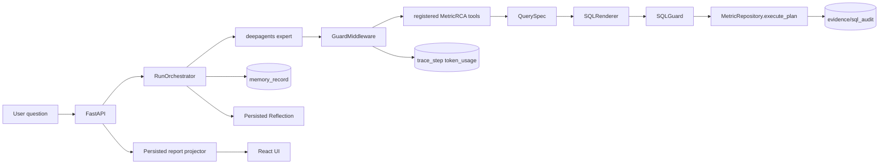
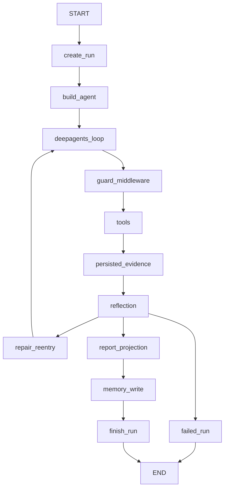
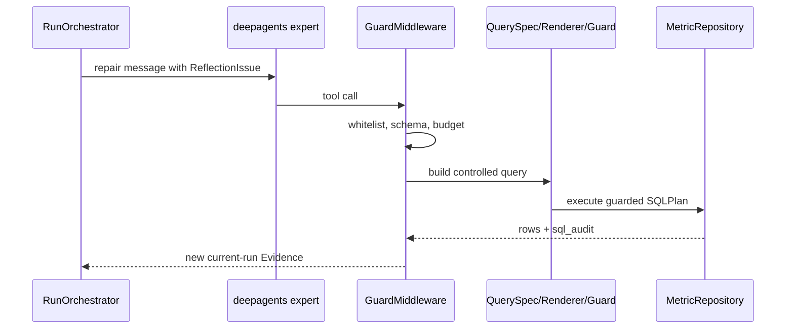
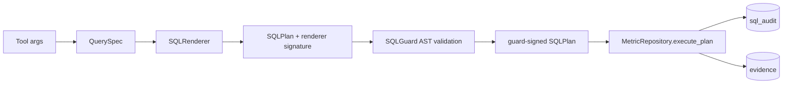
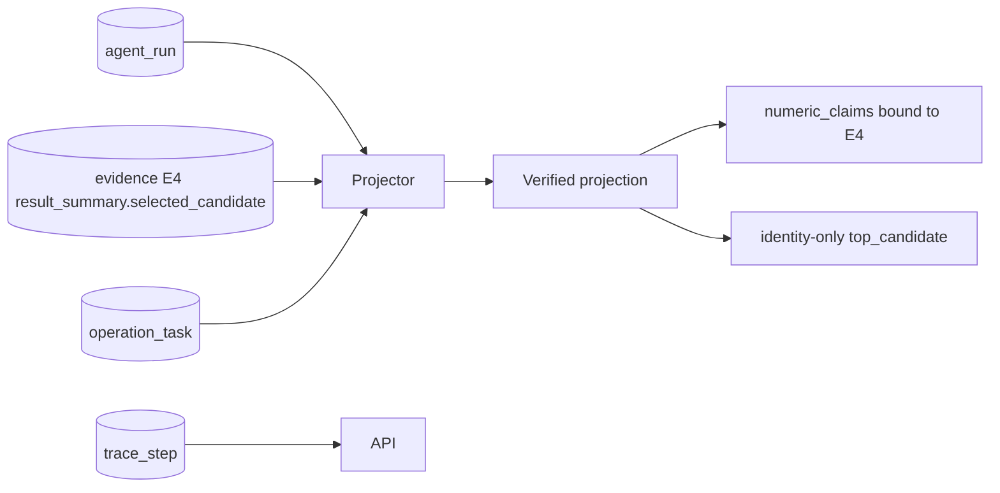
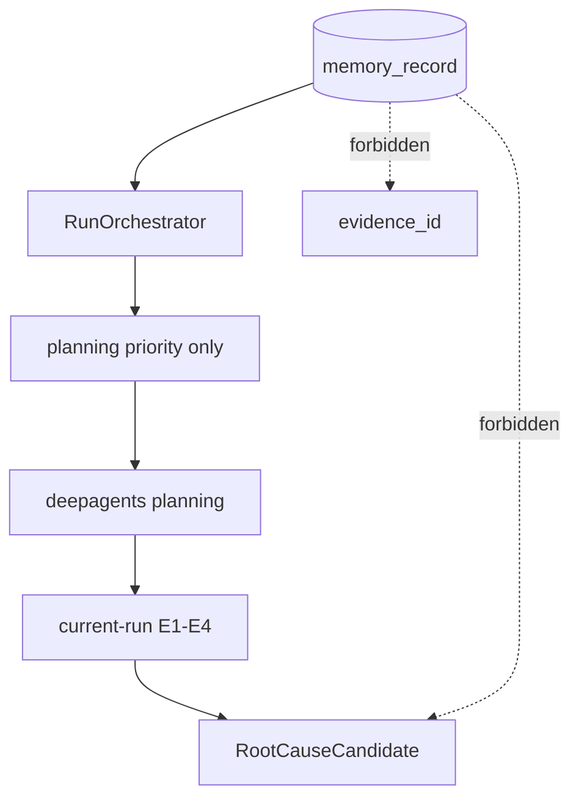
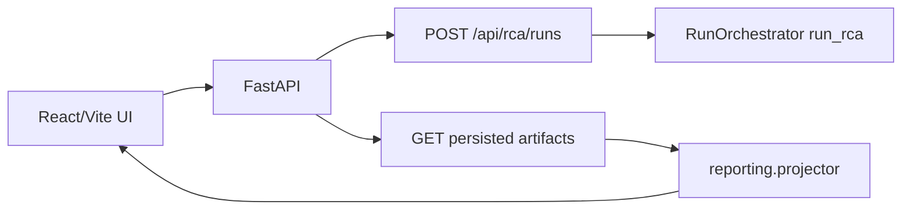
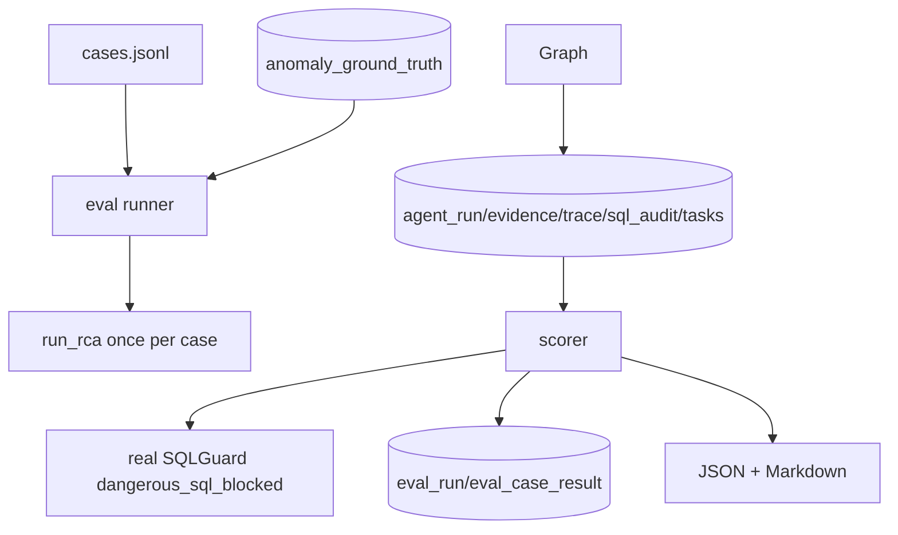

# MetricRCA Architecture

## Logical Architecture

## Orchestrator Control Flow

## deepagents Repair Path

## QuerySpec Data Path

## Persisted Report Reconstruction

## Memory Boundary

## API/UI Flow

## Eval Pipeline

