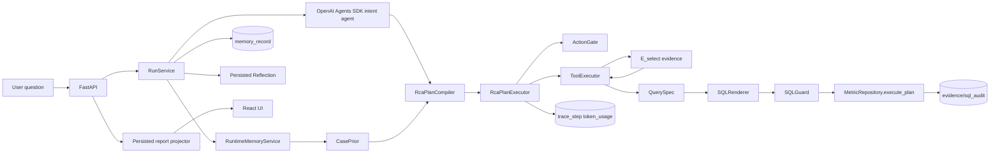
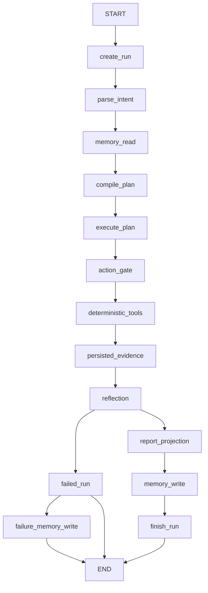
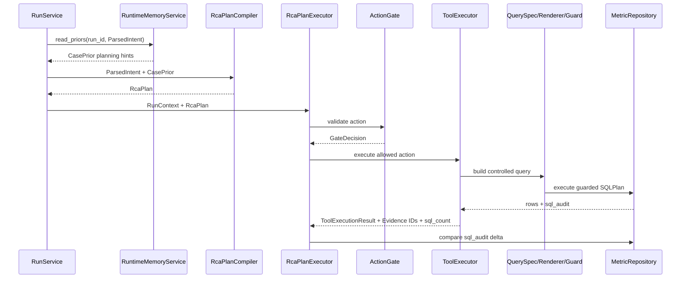
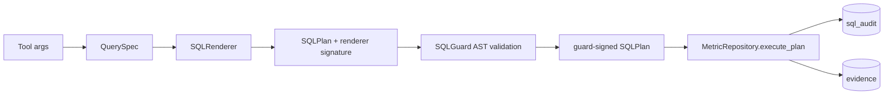
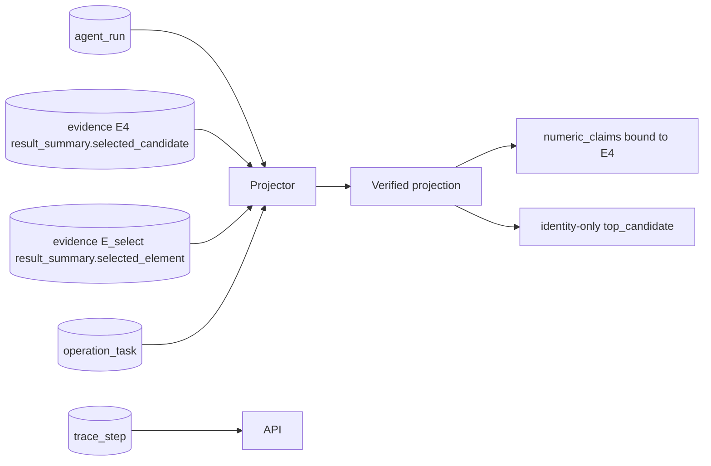
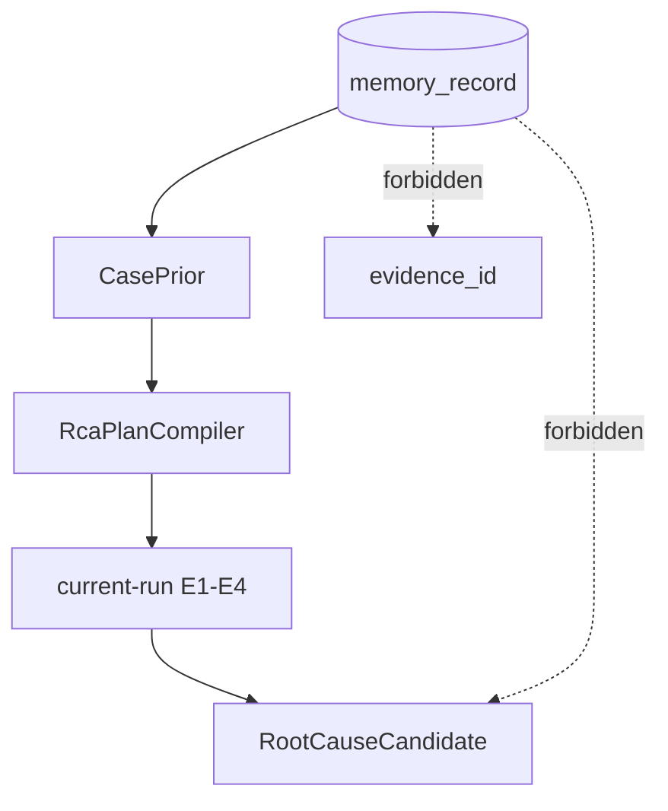
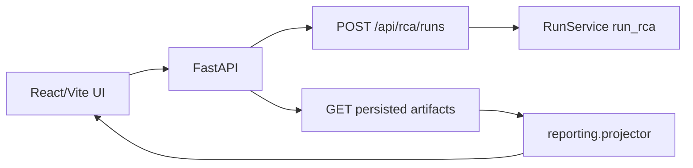
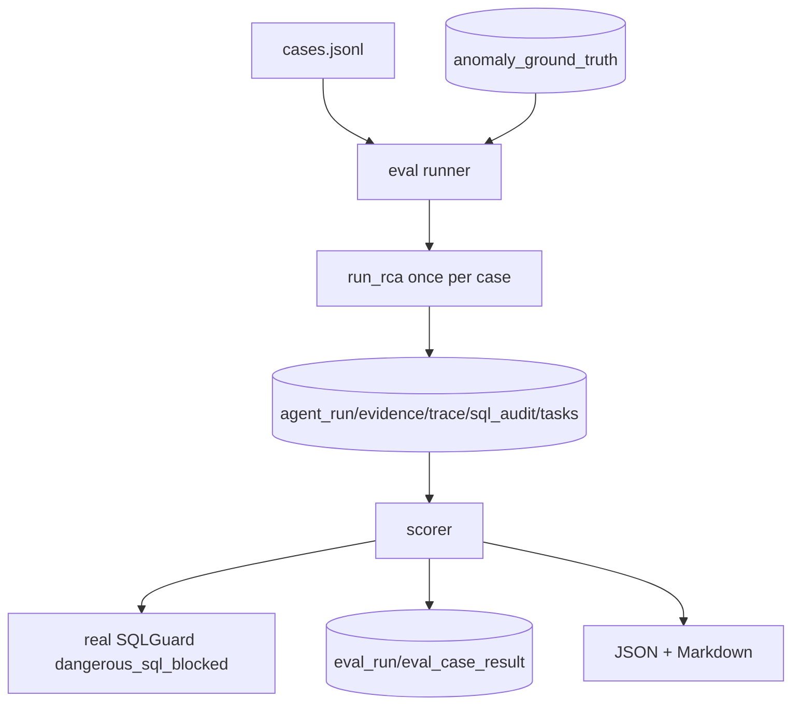

# MetricRCA Architecture

## Logical Architecture

## Runtime Control Flow

## Deterministic Plan Execution

## QuerySpec Data Path

## Persisted Report Reconstruction

## Memory Boundary

## API/UI Flow

## Eval Pipeline

