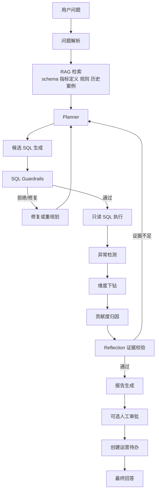
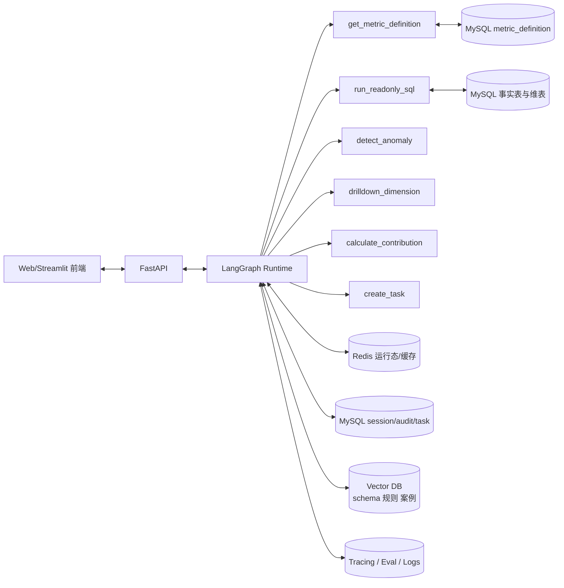

# 电商经营指标异常诊断与归因 Agent 项目设计报告

## 执行摘要

它天然覆盖 Agent 岗位最常被追问的能力面：

- 受控 ReAct 工具调用循环、
- 在线 Reflection 校验、
- 离线反思记忆、
- 短期/会话/长期三层记忆、
- SQL Guardrails、
- RAG、
- 可选 MCP 工具封装、
- 可观察性与评估闭环。

​	与此同时，它也和你当前项目背景形成互补：把你已经具备的“电商业务感”和“问数/SQL 能力”升维成一个完整的、可解释、可评估、可审计的 Agent 系统，而不是继续做“换皮客服”。你上传的项目要求文档里，**运营指标异常诊断助手、活动归因分析助手、经营指标异常诊断助手**本身就属于更适合用 LangGraph 这类编排框架去实现的题型，这和本项目方向完全一致。

​	从框架选择上，这个项目非常适合 **LangGraph + FastAPI + MySQL + Redis + Vector Store** 的组合：LangGraph 的定位就是为**长生命周期、状态化 agent**提供底层编排能力，强调 durable execution、human-in-the-loop、persistence 和 memory；OpenAI 的 Agents 指南则明确说明，当应用自己掌控**编排、工具执行、审批与状态**时，应当走 code-first 的 agent runtime 路线，而不是只做一次模型调用。

​	从工程落地上，建议你把系统做成 **单 Manager Agent + 多节点状态图** 的形态，而不是一上来就堆复杂 Multi-Agent。OpenAI 的官方建议是：**能用一个 agent 就先用一个 agent**，只有当能力隔离、策略隔离、提示词契约或追踪可读性真的发生变化时，才拆出 specialist；否则多 agent 只会带来更多 prompt、更多 trace、更多审批面，并不一定让系统更好。

​	从交付节奏上，做出一个**证据驱动的闭环**：用户输入“昨天 GMV 为什么下降”，系统能自动识别指标与口径、检索 schema/指标定义、生成并校验只读 SQL、查数、判断异常、沿渠道/类目/商品/库存等维度下钻、给出归因结论、输出证据和待办。1 个月版本再补强：更严密的 Guardrails、更强的 Reflection 与长期记忆、更系统的评估集、更多 trace 和失败分析、更成熟的 README 与面试材料。ReAct 和 Reflexion 两篇原始论文分别提供了“交替推理与行动”和“基于反馈的 verbal reflection + episodic memory”的理论基础；把二者放入经营诊断场景，比放在普通客服问答里更容易做出工程深度。

## 设计边界与工程取舍

​	这个项目不应该被做成“另一个会写 SQL 的聊天机器人”。如果只是“自然语言转 SQL + 返回表格”，面试官很容易把它归类成普通 Text-to-SQL；如果只是“查到异常后给一段总结”，面试官又会把它当作提示词工程。这个项目真正的价值，在于把 **问数、异常检测、归因、校验、待办闭环** 串成一个带状态的 agent workflow。LangGraph 对 workflows 和 agents 的区分也正好支持这种做法：**workflow 是预先定义好的路径，agent 则具备动态工具使用和反馈循环**；你的最佳形态不是完全自由代理，而是“**可控的 agentic workflow**”。

​	另一个关键取舍，是先做 **单图多节点**，再决定是否拆 **多 agent**。OpenAI 对 orchestration 的建议非常直接：如果 manager 应该保持最终回答所有权，就用 “agents as tools”；如果某个 specialist 应该真正接管该分支的回复，才用 handoff。对指标诊断这种场景，MVP 阶段通常不需要 specialist 接管最终回复，因为最终答复必须聚合多个证据面，manager 保持最终解释权更合理。

​	节点设计上，LangGraph 官方强调两件事很重要。第一，**把流程拆成离散节点**，不同节点可以有不同失败模式、不同重试策略、不同可观测性粒度；第二，**state 中存原始数据，不存已经格式化的 prompt 文本**，这样节点更容易复用、调试和演进。这个原则对经营诊断尤其重要，因为“解析问题”“查 schema”“跑 SQL”“做归因”“写报告”的失败模式完全不同，不能混成一个黑箱。

下面这张表给出本项目的边界建议。

| 模块 | 3 天 MVP 必做 | 1 个月增强 | 不建议一开始做 |
|---|---|---|---|
| 问题理解 | 指标、时间、对比口径解析 | 追问缺失口径、别名归一 | 复杂多轮 NL Planning |
| ReAct | 受控工具循环 | 更细的 stop/replan 策略 | 自由式无限循环 |
| Reflection | 在线证据校验 | 离线失败反思、memory 写回 | 纯 prompt 式“自我反思” |
| 记忆 | 运行态 state + 会话上下文 | 长期案例记忆、semantic retrieval | 聊天全量长记忆 |
| SQL 安全 | 只读账号 + AST 校验 + limit | 列级白名单、审批与慢查熔断 | 仅靠 prompt 限制 SQL |
| RAG | schema/指标定义/规则检索 | 历史案例与枚举字典检索 | 通用知识库大而全 |
| 多 agent | 不拆或只做逻辑拆分 | manager + critic + reporter | 5 个 agent 互相对话 |
| 评估 | 5–10 个异常 case | 20 个 case + trace grading | 只靠人工看输出 |
| 前端 | 最小交互页 | 结果 drill-down 面板 | 大屏可视化优先 |

这个范围控制本身，就是一个很好的面试答法：你不是不会做更多，而是知道在真实项目里先做“**高确定性闭环**”，再做“**高自由度扩展**”。

## 系统架构与节点编排

从理论上，这个项目组合了三类模式。

第一类是 ReAct：模型在“推理—行动—观察—更新计划”的循环中，通过外部工具取得事实证据；

第二类是 evaluator-optimizer：生成初版归因后，再由 critic 节点判断是否需要回炉；

第三类是 stateful workflow：整个过程在共享 state 上推进，具备持久化、可中断和可恢复能力。ReAct 论文强调 reasoning traces 与 actions 的交替，可以减少幻觉并提升可解释性；LangGraph 的 evaluator-optimizer 模式则明确给出了“生成—评估—反馈—重试”的闭环模板。

### 系统架构图



### 组件关系图



“MVP 用单 manager + 多节点图”的原因并不是保守，而是它最符合 OpenAI 和 LangGraph 文档对于生产 agent 的建议：**应用自己管理 orchestration、tool execution、approvals 和 state**；并且把节点拆开后，你就能更清楚地单测、追踪和重试。ToolNode 也是为这类图式设计的，官方说明它适合细粒度控制工具执行，并且可以处理并行工具执行、错误处理和状态注入

### LangGraph 节点设计表

| 节点名 | 职责 | 输入 | 输出 | 工具依赖 | 停止条件 |
|---|---|---|---|---|---|
| parse_question | 提取指标、时间范围、对比口径、维度偏好 | 用户问题 | `metric_name`, `time_range`, `compare_range` | 无 | 解析完成或请求澄清 |
| retrieve_context | 检索指标定义、schema、字段别名、业务规则 | 指标名、问题文本 | `metric_definition`, `schema_chunks`, `rules` | `get_metric_definition`, vector search | 检索命中足够上下文 |
| planner | 决定先查大盘还是直接分解到 UV/转化率/客单价/退款等 | 当前 state | `plan_steps`, `next_action` | 无 | 得到可执行下一步 |
| generate_sql | 生成只读 SQL 候选 | plan、schema、metric definition | `candidate_sql` | 无 | SQL 候选生成 |
| sql_guard | AST 校验、权限校验、性能校验 | `candidate_sql` | `approved_sql` 或 `reject_reason` | `run_readonly_sql` 的预执行校验器 | 通过或返回修复 |
| execute_sql | 执行查询并返回摘要 | `approved_sql` | `sql_results`, `row_count` | `run_readonly_sql` | 结果有效或执行失败 |
| detect_anomaly | 判断是否异常，估计波动方向与幅度 | 指标时序、对照组 | `anomalies`, `severity` | `detect_anomaly` | 判定完成 |
| drilldown | 沿渠道/类目/商品/地区/设备等维度下钻 | 当前异常与计划 | `drilldown_results` | `drilldown_dimension` | 找到主要贡献集或达到深度上限 |
| attribution | 计算贡献度、合并证据、生成 root cause 候选 | drilldown 结果、辅助特征 | `root_causes`, `confidence` | `calculate_contribution` | Top-K 原因稳定 |
| critic | 在线 Reflection：检查证据、逻辑一致性、遗漏维度 | 当前报告草稿与证据 | `critic_feedback`, `needs_retry` | 无 | 通过或要求回退 |
| report | 生成用户可读报告与证据表 | root causes、evidence | `final_report` | 无 | 报告完成 |
| interrupt_review | 对敏感 SQL 或自动建任务做人工审批 | report、task draft | `approval_state` | 人工/审批 UI | 通过、拒绝或修改 |
| create_task | 生成运营动作与跟进项 | 归因结论与建议 | `tasks` | `create_task` | 任务落库完成 |

这张表的设计依据，是 LangGraph 对“**离散节点 + 条件边 + 共享状态**”的建模方式，以及其对 human-in-the-loop、memory、tool execution 的原生支持。citeturn25view4turn6view0turn8view1

## 数据与接口设计

### 数据模型表

下面的数据模型是为“**经营指标异常诊断**”这个主场景服务的，强调可归因，而不是把整个电商业务建模到极致。对 3 天 MVP 来说，只要能生成 30–60 天的模拟数据并注入异常，就足够完成演示与评估。

| 表名 | 关键字段 | 示例数据量 | 用途 | 可注入异常类型 |
|---|---|---:|---|---|
| `dim_product` | `product_id`, `sku_id`, `product_name`, `category_lv1`, `category_lv2`, `brand`, `list_price` | 2k–5k | 商品维度 | 爆品缺货、类目结构突变、价格异常 |
| `dim_user` | `user_id`, `province`, `city`, `user_level`, `register_date`, `is_new_user` | 50k–200k | 用户分层 | 新老客占比变化、地区流量变化 |
| `dim_channel` | `channel_id`, `channel_name`, `source_type`, `cost_model` | 20–50 | 渠道维度 | 某渠道流量骤降、成本飙升 |
| `fact_order` | `order_id`, `user_id`, `product_id`, `channel_id`, `pay_amount`, `order_status`, `pay_time`, `refund_amount` | 20万–100万 | GMV、支付转化、退款等核心指标 | GMV 下跌、退款率上升、客单价下降 |
| `fact_traffic` | `stat_date`, `channel_id`, `product_id`, `uv`, `pv`, `click_cnt`, `cart_cnt`, `pay_user_cnt` | 5万–20万 | 漏斗链路 | CTR/加购率/支付转化率异常 |
| `fact_inventory` | `stat_date`, `product_id`, `stock_qty`, `out_of_stock_flag`, `safety_stock` | 5万–20万 | 库存与供给侧 | 缺货、超卖保护触发 |
| `fact_campaign` | `campaign_id`, `product_id`, `channel_id`, `start_date`, `end_date`, `discount_rate`, `budget`, `spend` | 1k–10k | 活动与投放 | 活动结束、预算掉量、ROI 异常 |
| `fact_ticket` | `ticket_id`, `user_id`, `product_id`, `issue_type`, `sentiment`, `created_at` | 1万–5万 | 客诉与质量问题 | 投诉激增、负面情绪上升 |
| `metric_definition` | `metric_name`, `business_desc`, `sql_formula`, `time_field`, `default_grain`, `filters` | 30–100 | 指标口径库 | GMV/净 GMV/支付转化等口径歧义 |
| `enum_dictionary` | `field_name`, `alias`, `canonical_value` | 100–500 | 值标准化 | “抖音/巨量/字节广告”等别名统一 |
| `rca_case_memory` | `case_id`, `incident_type`, `root_cause_label`, `evidence_summary`, `confidence` | 20–200 | 长期案例记忆 | 历史异常案例回忆 |
| `agent_audit_log` | `run_id`, `node_name`, `input_summary`, `output_summary`, `latency_ms`, `status` | 持续增长 | 审计与追踪 | 失败定位、在线回放 |

这里最重要的不是表多，而是 **每张表都能支持归因证据**。例如 `fact_order` 单独只能回答“结果变了”，但加上 `fact_traffic`、`fact_inventory`、`fact_campaign`、`fact_ticket` 之后，系统才能区分“是流量下来了”“是库存炸了”“是活动结束了”“还是客诉影响了转化”。

### RAG 语料面

RAG 在这个项目中不是为了回答“通用知识问题”，而是为了控制 **业务口径、字段语义和案例记忆**。LangGraph 文档把 tool calling、structured outputs 和 short-term memory 都归类为 LLM augmentations；对这个项目而言，RAG 也是同一层增强：它不是核心结论来源，而是为工具使用和决策提供上下文约束。citeturn25view2

| RAG 语料 | 来源 | 用途 | 存储建议 |
|---|---|---|---|
| 指标定义 | `metric_definition` | 限定公式与默认口径 | MySQL + cache |
| 表结构与字段注释 | schema dump / 手工说明文档 | 约束 SQL 生成 | Vector DB |
| 枚举别名字典 | `enum_dictionary` | 口语值标准化 | MySQL |
| 归因规则 | 手工规则文档 | 例如“UV 稳定但 CVR 掉时先看库存/价格” | Vector DB |
| 历史异常案例 | `rca_case_memory` | 类似问题的先验提醒 | Vector DB + MySQL |
| 审批规则与 SQL 安全规则 | guardrail policy | 限制高风险工具调用 | Vector DB / code |

### 工具接口定义

MCP 规范把 **tools** 定义为可由语言模型调用的函数，把 **resources** 定义为可共享的上下文数据，如文件、数据库 schema 或业务信息；对应到本项目，**schema/指标定义/案例记忆更适合作为 resources 或可检索文档**，而 **查数、检测、归因、建任务** 更适合作为 tools。MCP 的标准消息也分别提供了 `tools/list`、`tools/call`、`resources/list` 和 `resources/read`。citeturn12view0turn12view1turn53view1turn53view3

| 工具名 | 输入 | 输出 | 说明 | 可选 MCP 封装 |
|---|---|---|---|---|
| `get_metric_definition` | `metric_name`, `question` | 指标解释、公式、默认时间粒度、过滤条件 | 给 planner 与 SQL 生成器提供业务口径 | tool 或 resource-backed query |
| `run_readonly_sql` | `sql`, `dialect`, `reason` | 结果集摘要、采样行、统计元信息 | 只读执行器，必须走 guardrail | tool |
| `detect_anomaly` | `metric_name`, `series`, `baseline_cfg` | 是否异常、异常分值、波动方向 | 可先做 z-score / 环比阈值法 | tool |
| `drilldown_dimension` | `metric_name`, `dimension`, `time_range`, `filters` | 维度明细变化、排序后的贡献项 | 渠道/类目/商品/地区等下钻 | tool |
| `calculate_contribution` | 当前值、对照值、维度变化集 | Top-K root causes, contribution, confidence | 贡献度/归因聚合器 | tool |
| `create_task` | 结论、owner、deadline、severity | `task_id`, `status` | 形成闭环动作 | tool |
| `get_schema_context` | `question`, `candidate_tables` | schema chunks, joins, value hints | RAG 入口之一 | resource or retriever |
| `search_case_memory` | `incident_signature`, `query` | 相似历史 case | 离线反思与类似案召回 | resource-backed semantic search |

### E2E API 设计

建议 API 层保持非常克制，不要一开始做成十几个业务端点。围绕“**运行一次诊断**”“**查看一次运行**”“**审批一次中断**”“**跑一次评估**”这四类能力就够了。

| 路径 | 方法 | 作用 |
|---|---|---|
| `/v1/runs` | `POST` | 发起一次 RCA 诊断 |
| `/v1/runs/{run_id}` | `GET` | 获取报告、trace 摘要、证据、任务 |
| `/v1/runs/{run_id}/resume` | `POST` | 对中断的审批流进行 accept / reject / edit |
| `/v1/metrics` | `GET` | 列出指标定义 |
| `/v1/evals/run` | `POST` | 对异常注入集执行自动评估 |
| `/v1/evals/{eval_id}` | `GET` | 查询评估结果 |
| `/v1/healthz` | `GET` | 健康检查 |

最小输入输出 schema 可以这样定义：

```python
from typing import Any, Literal
from pydantic import BaseModel, Field

class RCARunRequest(BaseModel):
    question: str = Field(..., description="例如：昨天 GMV 为什么下降了？")
    thread_id: str | None = None
    use_memory: bool = True
    require_human_approval: bool = False

class RootCauseItem(BaseModel):
    dimension: str
    value: str
    contribution: float
    evidence_ids: list[str]
    confidence: float

class EvidenceItem(BaseModel):
    evidence_id: str
    sql: str
    summary: str
    row_count: int

class RCARunResponse(BaseModel):
    run_id: str
    status: Literal["running", "completed", "interrupted", "failed"]
    summary: str | None = None
    root_causes: list[RootCauseItem] = []
    evidence: list[EvidenceItem] = []
    tasks: list[dict[str, Any]] = []
    next_action: str | None = None
```

前端最小交互不要复杂化。一个输入框、一个“开始诊断”按钮、三块结果区即可：**结论摘要**、**证据 SQL 与查询结果**、**待办建议**。如果你想 3 天内省时间，直接用 Streamlit；如果你想为简历加一点工程味，再补一个极简 React 页面即可。

```python
# streamlit_app.py
import streamlit as st
import requests

st.title("Metric-RCA Agent")
q = st.text_input("输入问题", "昨天 GMV 为什么下降了？")

if st.button("开始诊断"):
    res = requests.post("http://localhost:8000/v1/runs", json={"question": q}).json()
    st.subheader("结论摘要")
    st.write(res.get("summary"))

    st.subheader("归因结果")
    st.json(res.get("root_causes", []))

    st.subheader("证据")
    st.json(res.get("evidence", []))

    st.subheader("待办")
    st.json(res.get("tasks", []))
```

## ReAct、Reflection、记忆与 Guardrails

### ReAct 工具调用循环

ReAct 的原始思想不是“让模型多想一步”，而是让模型把 **reasoning trace** 和 **external actions** 交替起来：先形成下一步计划，再调用外部环境，再根据观测修正计划。LangGraph 的自定义 SQL agent 指南也明确展示了这种受控 ReAct 形态：用专门节点去承载不同 tool call，而不是只靠一个 prompt 约束模型“先 list tables、再 check query、再执行”。citeturn10academia0turn7view1

在项目里，ReAct 最好写成“**受控循环**”，而不是放任自由代理。因为 SQL 场景天然高风险，LangGraph 的 SQL 教程明确提醒：执行模型生成 SQL 存在内在风险，数据库权限必须尽可能窄；教程里的数据库工具也被官方标明为“只是演示，不适合生产”，生产中必须添加业务验证。citeturn7view1

一个合格的 ReAct 伪代码可以长这样：

```python
MAX_STEPS = 8
MAX_DRILL_DEPTH = 3

def react_rca_loop(state: RCAState) -> RCAState:
    for _ in range(MAX_STEPS):
        action = planner_decide_next_action(state)

        if action.name == "ask_clarification":
            state.next_action = action.args["question"]
            return state

        if action.name == "generate_sql":
            sql = generate_sql(state, action.args)
            verdict = validate_sql(sql, allow_tables=state.allow_tables)
            if not verdict.ok:
                state.reflection_notes.append(
                    f"SQL rejected: {verdict.reason}"
                )
                state.errors.append(verdict.reason)
                continue

            result = run_readonly_sql(sql=verdict.sql, dialect="mysql", reason=action.reason)
            state.tool_calls.append({"tool": "run_readonly_sql", "sql": verdict.sql})
            state.sql_results.append(result)
            state = update_state_from_sql(state, result)

        elif action.name == "detect_anomaly":
            anomaly = detect_anomaly(
                metric_name=state.metric_name,
                series=state.metric_series,
                baseline_cfg=state.baseline_cfg,
            )
            state.anomalies.append(anomaly)

        elif action.name == "drilldown_dimension":
            drill = drilldown_dimension(**action.args)
            state.drilldown_results.append(drill)

        elif action.name == "calculate_contribution":
            causes = calculate_contribution(**action.args)
            state.root_causes = merge_root_causes(state.root_causes, causes)

        elif action.name == "finish":
            break

        if should_stop(state, max_depth=MAX_DRILL_DEPTH):
            break

    return state
```

一个高质量停止条件，通常包括这些逻辑：

| 停止信号 | 含义 |
|---|---|
| Top-K 贡献累计超过阈值 | 例如前 3 个原因已解释 80% 波动 |
| 下钻深度达到上限 | 防止 agent 一直向商品级无限钻取 |
| 连续两次 SQL 被 guardrail 拒绝 | 说明规划存在问题，应该回退 |
| Critic 判断证据充分 | 可以进入报告生成 |
| 必要口径缺失 | 触发澄清或人工确认 |

### Reflection 策略

Reflection 分两层做。

第一层是 **在线 Reflection**。LangGraph 的 evaluator-optimizer 工作流本质上就是这一层：一个节点生成结果，另一个节点评价结果，如果评价不过就带着反馈回到前一个节点，直到满足成功标准。这个模式非常适合经营归因，因为归因报告最怕“语义流畅但证据不够”。citeturn54view0

第二层是 **离线 Reflection**。Reflexion 原论文强调：agent 不需要更新权重，也可以通过语言化反馈形成“反思文本”，并把它维护在 episodic memory 中，指导后续类似任务的决策。换到本项目里，就是把“这次误判为什么会发生”“下次遇到类似信号应该先查什么”沉淀成结构化经验。citeturn10academia1

| 反思层次 | 触发时机 | 反馈信号 | 产出 | 写入位置 |
|---|---|---|---|---|
| 在线 Reflection | 单次 run 内报告生成后 | 证据缺失、逻辑矛盾、时间口径不一致、遗漏关键维度 | `critic_feedback`, `needs_retry` | 当前 state |
| 离线 Reflection | eval 失败、人工驳回、误归因复盘后 | ground truth vs predicted mismatch | `lesson`, `failure_pattern`, `recommended_checks` | 长期记忆表 / 向量库 |

在线 Reflection 的判断规则建议写得非常硬：

| 检查项 | 不通过的典型例子 |
|---|---|
| 结论是否有证据 | 说“抖音渠道导致 GMV 下跌”，但没有渠道维度 SQL |
| 口径是否一致 | 主报 GMV，证据却用净 GMV |
| 相关性是否冒充因果 | 投诉上升与转化下降同时发生，但没有时间先后关系 |
| 是否遗漏关键解释变量 | UV 稳定、CVR 掉，却没有查库存和价格 |
| 是否超出置信区间 | 贡献度分散，没有主要原因，却输出了单一结论 |

### 记忆管理设计

LangGraph 的 memory 文档把 memory 分为 **短期 memory** 和 **长期 memory**：短期 memory 属于 state / thread-level persistence，用于多轮对话和当前运行；长期 memory 用于跨 session 保存 user-specific 或 application-level data。文档同时给出了上下文爆炸时的治理策略：trim、delete、summarize messages，以及使用 semantic search 的 long-term memory。这个项目可以据此扩展成更贴近业务的“三层记忆”：**短期运行态、会话记忆、长期案例记忆**。citeturn9view0turn9view1turn9view2turn9view3

| 记忆层 | 作用域 | 存什么 | 建议存储 | 淘汰策略 |
|---|---|---|---|---|
| 短期记忆 | 单次 run | 解析结果、tool calls、SQL 结果摘要、已下钻维度、critic 反馈 | Redis / LangGraph checkpointer | TTL 24h；长结果只存摘要 |
| 会话记忆 | 同一 thread | 当前关注指标、时间口径、用户偏好维度、未完成审批状态 | Redis + MySQL session | 7–30 天；归档历史 |
| 长期记忆 | 跨 session | 历史异常案例、reflection lessons、字段别名、业务规则 | MySQL + Vector DB | 置信度门控、版本号、人工确认、定期重嵌入 |

安全和 PII 处理必须明确，否则很容易被面试官追问：

| 风险点 | 建议 |
|---|---|
| 原始订单/用户数据过度进入 memory | memory 只存摘要与证据 ID，不存大结果集 |
| 用户 ID、手机号等敏感字段泄漏 | 入库前 hash / mask；报告层不返回 PII |
| 过期规则口径污染后续判断 | 长期记忆带 `schema_version` / `metric_version` |
| 错误反思污染系统 | 低置信度或未验证 reflection 不写入长期 memory |
| 上下文过长导致性能差 | 会话消息采用 summarize + checkpoint，而不是全量保留 |

### SQL Guardrails 设计清单

SQL Guardrails 是这个项目的生命线。LangGraph SQL 教程已经说得很清楚：模型生成 SQL 天生有风险，数据库权限要严格收缩；教程示例工具不是生产安全方案。OpenAI 的 guardrails 指南则进一步把控制面分成 input / output / tool guardrails 和 human review，并明确指出：**对函数工具前后的参数或结果校验属于 tool guardrails；对取消、修改、shell 或敏感 MCP 行为等可能产生副作用的动作，应该走 human review**。citeturn7view1turn21view5

| 类别 | 规则 | 示例 |
|---|---|---|
| 语句类型 | 只允许 `SELECT` / 只读 CTE | 拒绝 `UPDATE`, `DELETE`, `DROP`, `ALTER`, `TRUNCATE` |
| 多语句 | 禁止 `;` 链式执行 | 拒绝 `SELECT ...; DROP TABLE ...` |
| 表白名单 | 只能访问授权表 | 拒绝访问 `user_private_profile` |
| 列白名单 | 只允许授权列 | 拒绝手机号、身份证号等敏感列 |
| `SELECT *` | 默认拒绝 | 强制列投影 |
| LIMIT | 无 `LIMIT` 自动拒绝或注入上限 | 默认 `LIMIT 200` |
| JOIN 复杂度 | 限制 JOIN 数与笛卡尔积风险 | 超过 5 表 JOIN 需审批 |
| 时间范围 | 强制时间范围存在 | 避免全表扫描 |
| 扫描成本 | 估计 scan rows / explain 风险 | 超阈值转人工 |
| 派生 SQL | 禁止 `INTO OUTFILE` 等导出语句 | 防止数据外流 |
| 返回行数 | 截断大结果，只返回摘要 | 减小上下文与泄漏风险 |
| 审计 | 记录原 SQL、归一化 SQL、拒绝原因 | 便于复盘 |

利用 sqlglot 做 AST 级校验是非常自然的：sqlglot 官方 README 明确说明，它是 SQL parser / transpiler / optimizer / engine，能自定义 parser、分析查询、遍历 expression tree、程序化构造 SQL，并且可以检测语法错误与 dialect incompatibility；文档也展示了如何用 `parse_one(...).find_all(exp.Table/exp.Column/exp.Select)` 去枚举表、列和投影。citeturn14view0turn15view1turn15view2turn15view3

```python
from dataclasses import dataclass
from sqlglot import parse_one, exp
from sqlglot.errors import ParseError

ALLOWED_TABLES = {
    "fact_order", "fact_traffic", "fact_inventory",
    "fact_campaign", "fact_ticket",
    "dim_product", "dim_user", "dim_channel",
    "metric_definition", "enum_dictionary"
}

DENY_NODES = (
    exp.Insert, exp.Update, exp.Delete, exp.Drop,
    exp.Alter, exp.Create, exp.Truncate, exp.Command,
)

@dataclass
class Verdict:
    ok: bool
    reason: str = ""
    normalized_sql: str | None = None

def validate_sql(sql: str, dialect: str = "mysql") -> Verdict:
    try:
        tree = parse_one(sql, dialect=dialect)
    except ParseError as e:
        return Verdict(False, f"parse error: {e}")

    if not isinstance(tree, (exp.Select, exp.Union, exp.CTE)):
        return Verdict(False, "only read-only SELECT/CTE queries are allowed")

    for node in tree.walk():
        if isinstance(node, DENY_NODES):
            return Verdict(False, f"forbidden statement: {type(node).__name__}")

    # 禁用多语句
    stripped = sql.strip()
    if ";" in stripped[:-1]:
        return Verdict(False, "multi-statement SQL is forbidden")

    # 表白名单
    for table in tree.find_all(exp.Table):
        if table.name not in ALLOWED_TABLES:
            return Verdict(False, f"table not allowed: {table.name}")

    # 禁止 SELECT *
    for select in tree.find_all(exp.Select):
        for proj in select.expressions:
            if isinstance(proj, exp.Star):
                return Verdict(False, "SELECT * is forbidden")

    # 强制 LIMIT
    has_limit = any(select.args.get("limit") is not None for select in tree.find_all(exp.Select))
    if not has_limit:
        return Verdict(False, "LIMIT is required")

    return Verdict(True, normalized_sql=tree.sql(dialect=dialect))
```

典型拒绝示例：

| SQL | 拒绝原因 |
|---|---|
| `UPDATE fact_order SET pay_amount = 0 WHERE ...` | 非只读语句 |
| `SELECT * FROM fact_order LIMIT 100` | `SELECT *` 禁止 |
| `SELECT ... FROM fact_order` | 没有 `LIMIT` |
| `SELECT ... FROM user_private_profile LIMIT 10` | 非白名单表 |
| `SELECT ...; DROP TABLE fact_order;` | 多语句执行 |
| `SELECT ... INTO OUTFILE '/tmp/a.csv'` | 导出语句风险 |

对于高风险查询或自动创建任务，建议加 **人工审批中断**。LangGraph SQL 教程给出的实现方式就是在工具节点外包一层 `interrupt`，借助 persistence/checkpointer 暂停并恢复；OpenAI Agents 的 guardrails/human review 指南也把这种控制面作为标准做法。citeturn8view1turn21view5turn22view2

### 最小状态模型片段

```python
from pydantic import BaseModel, Field
from typing import Any

class RCAState(BaseModel):
    run_id: str
    thread_id: str | None = None
    user_question: str

    metric_name: str | None = None
    time_range: dict[str, Any] | None = None
    compare_range: dict[str, Any] | None = None

    metric_definition: dict[str, Any] | None = None
    schema_chunks: list[str] = []
    rules: list[str] = []

    plan_steps: list[str] = []
    tool_calls: list[dict[str, Any]] = []
    sql_candidates: list[str] = []
    sql_results: list[dict[str, Any]] = []

    anomalies: list[dict[str, Any]] = []
    drilldown_results: list[dict[str, Any]] = []
    root_causes: list[dict[str, Any]] = []
    evidence: list[dict[str, Any]] = []

    critic_feedback: list[str] = []
    reflection_notes: list[str] = []

    tasks: list[dict[str, Any]] = []
    final_report: str | None = None
    status: str = "running"
    errors: list[str] = []
```

## 可观测性、评估与异常注入

### Observability 方案

如果这个项目没有 trace、没有审计、没有失败分类，几乎一定会在面试里失分。OpenAI 的 observability 指南明确指出，Agents SDK 内建 tracing：每次 run 都可以发出结构化记录，覆盖 model calls、tool calls、handoffs、guardrails 和自定义 spans；官方还建议把 traces 用于两件事：先调试工作流，再把高信号样本送入正式 eval。LangGraph 侧也把 LangSmith tracing / evaluation 作为 production-ready agent 的关键支撑。citeturn21view0turn6view0

建议追踪这些对象：

| 追踪对象 | 关键字段 | 作用 |
|---|---|---|
| `agent_run` | `run_id`, `question`, `status`, `latency_ms`, `token_usage`, `final_summary` | 端到端观测 |
| `agent_step` | `node_name`, `input_summary`, `output_summary`, `latency_ms`, `retry_count` | 节点诊断 |
| `tool_call` | `tool_name`, `args`, `result_summary`, `is_interrupted`, `error` | 工具问题定位 |
| `sql_audit` | `raw_sql`, `normalized_sql`, `guardrail_verdict`, `row_count`, `cost_estimate` | SQL 安全审计 |
| `critic_record` | `feedback`, `needs_retry`, `retry_from_node` | Reflection 效果 |
| `memory_event` | `memory_type`, `key`, `hit`, `ttl`, `confidence` | 记忆命中与污染分析 |

### 评估指标表

OpenAI 的 eval 指南建议：**还在调试阶段时先从 traces 开始**，因为 trace grading 是发现 workflow 级问题最快的方法；当你知道什么是“好结果”后，再转向数据集与可重复 eval runs。对这个项目最好的落地方式，就是把评估分成 SQL 层、归因层、报告层、系统层四层。citeturn21view2turn21view3

| 指标 | 定义 | 为什么重要 |
|---|---|---|
| SQL 执行成功率 | `成功执行 SQL 数 / 生成 SQL 数` | 反映问数链路稳定性 |
| Guardrail 拦截率 | `被拒危险 SQL / 危险 SQL 总数` | 反映安全面 |
| Guardrail 误杀率 | `被拒但其实合法 SQL / 合法 SQL 总数` | 反映可用性 |
| Top-1 归因命中率 | `首因命中 ground truth / case 数` | 最直观核心指标 |
| Top-3 归因命中率 | `前 3 原因覆盖真实根因 / case 数` | 更符合现实排障 |
| 证据覆盖率 | `有证据支撑的结论数 / 结论总数` | 防止“编故事” |
| Reflection 修复率 | `critic 触发后修复成功 / critic 触发总数` | 检查 online reflection 价值 |
| Memory 命中提升 | `启用长期 memory 后 Top-1 提升` | 验证长期记忆是否有用 |
| 端到端 P50/P95 延迟 | 单次 run 总时延 | 工程可用性 |
| 单次成本 | token + 查询成本 | 生产可控性 |

### 异常注入 case 列表

下面这 20 个 case 足够支撑一个月内的系统化评估。每个 case 都应该有 **问题模板、注入脚本、ground truth root cause、期望证据面**。

| Case | 用户问题 | 注入根因 | 期望证据面 |
|---|---|---|---|
| C01 | 昨天 GMV 为什么跌了 | 抖音渠道 UV 下降 | 渠道流量 |
| C02 | 昨天 GMV 为什么跌了 | 爆品库存为 0 | 库存 + 商品 |
| C03 | 昨天支付转化率为何下降 | 某类目价格上调 | 类目 + 价格 |
| C04 | 昨天净 GMV 为何下降 | 退款率激增 | 订单 + 退款 |
| C05 | 本周 ROI 为何变差 | 预算投向低质渠道 | 活动 + 渠道 |
| C06 | 新客转化率为何下降 | 落地页点击异常 | 流量漏斗 |
| C07 | 华东区 GMV 下滑原因 | 华东物流投诉增加 | 地区 + 工单 |
| C08 | 某类目客单价下降原因 | 低价 SKU 占比突增 | 商品结构 |
| C09 | 大盘 GMV 下滑原因 | 活动结束未续期 | 活动时间窗 |
| C10 | 某商品支付率下降 | 页面流量正常但缺货 | 商品 + 库存 |
| C11 | 活跃用户下降 | 某端 APP crash 激增 | 设备端事件 |
| C12 | 老客复购下降 | 售后投诉上升 | 工单 + 用户层 |
| C13 | 渠道 CAC 飙升 | 点击不变、付费人数下降 | 渠道 + 成本 |
| C14 | 加购率下降 | 详情页 PV 不变但点击下降 | 漏斗中层 |
| C15 | 退款率上升 | 某品牌质量问题 | 品牌 + 工单 |
| C16 | 客单价上升但 GMV 下降 | UV 与转化同时下跌 | 分解式解释 |
| C17 | 新用户比例异常升高 | 某拉新活动带来低质流量 | 活动 + 用户层 |
| C18 | 某地区转化率异常 | 支付通道故障模拟 | 地区 + 支付链路 |
| C19 | 某渠道订单减少 | 广告素材审批失败 | 渠道 + 活动 |
| C20 | 大盘指标异常但无单一主因 | 多因素轻度叠加 | 低置信度输出 |

### 自动化评估流程

```python
# eval_runner.py
from pathlib import Path
import json
import requests

def run_eval(case_path: str):
    cases = [json.loads(x) for x in Path(case_path).read_text().splitlines()]
    metrics = {
        "sql_success": 0,
        "top1_hit": 0,
        "top3_hit": 0,
        "evidence_coverage": [],
        "latencies": [],
    }

    for case in cases:
        # 1) 先调用注入脚本写入 ground truth 异常
        requests.post("http://localhost:8000/v1/evals/inject", json=case)

        # 2) 再跑 agent
        res = requests.post("http://localhost:8000/v1/runs", json={"question": case["question"]}).json()

        # 3) 比较结果
        root_causes = res.get("root_causes", [])
        labels = [x["value"] for x in root_causes]

        if res.get("status") == "completed":
            metrics["sql_success"] += int(res.get("meta", {}).get("sql_success", False))

        gt = case["ground_truth"]
        metrics["top1_hit"] += int(labels[:1] == [gt["top1"]])
        metrics["top3_hit"] += int(gt["top1"] in labels[:3])

        metrics["evidence_coverage"].append(res.get("meta", {}).get("evidence_coverage", 0.0))
        metrics["latencies"].append(res.get("meta", {}).get("latency_ms", 0))

    return metrics
```

这个流程和 OpenAI 的“先 traces、再 graders、再 datasets/eval runs”的建议是一致的：先把每个 run 的行为过程看透，再把它批量化评分。citeturn21view2turn21view3

## 实施路线、简历写法与面试准备

### 三天 MVP 任务分解

| 时间 | 交付物 |
|---|---|
| 第一天 | MySQL 表结构、seed 脚本、5 个异常注入 case、`metric_definition` 口径库、`run_readonly_sql` 与 `validate_sql` |
| 第二天 | LangGraph 主图跑通：问题解析、RAG 检索、SQL 生成、SQL Guardrail、执行、异常检测、下钻、贡献度归因、报告输出 |
| 第三天 | 在线 critic 节点、FastAPI API、最小前端页、trace/audit 落库、README、架构图、测试截图、5 个 eval case 跑分 |

这三天里最重要的不是“把功能堆满”，而是把 **一条主链路做成 demo + 评估 + 截图**。没有 eval 的 Agent 项目，在面试里很容易被打成“prompt demo”。

### 一个月强化路线

| 周次 | 强化重点 | 目标 |
|---|---|---|
| 第一周 | 稳定主链路与 README | 一键启动、数据可复现、截图完整 |
| 第二周 | SQL Guardrails 强化 | AST 白名单、列级限制、审计、审批中断 |
| 第三周 | Reflection 与长期记忆 | 在线 critic、离线 reflexion、案例记忆召回 |
| 第四周 | 评估与面试材料 | 20 个 case、指标看板、失败分析、简历与问答脚本 |

### 简历可写条目示例

下面这些写法经得起追问，比“用 LangGraph 做了智能 Agent”强得多。

| 条目 | 写法 |
|---|---|
| 项目总述 | 设计并实现面向电商经营分析的 Metric-RCA Agent，基于 LangGraph 编排问题解析、指标定义检索、只读 SQL 生成、AST Guardrail、异常检测、维度下钻、贡献度归因、在线 Reflection 校验和运营待办生成，实现从自然语言问题到诊断报告与行动闭环。 |
| 安全与工具链 | 构建只读 SQL 执行链路，基于 sqlglot 完成 AST 级语句类型、表白名单、`SELECT *`、`LIMIT`、多语句等规则校验，并对高风险 SQL 与任务创建增加人工审批中断。 |
| 记忆设计 | 设计短期运行态、会话记忆与长期案例记忆三级存储；将历史异常案例、字段别名和离线反思经验向量化存储，并通过置信度、版本号与 TTL 控制 memory pollution。 |
| 评估体系 | 构造 20 组 ground-truth 异常注入样本，按 SQL 执行成功率、Top-1/Top-3 归因命中率、证据覆盖率、Reflection 修复率与端到端延迟评估 Agent 质量。 |

### 面试热点问答清单

下表给出至少 20 个最容易被追问的问题，以及建议回答要点。

| 面试问题 | 回答要点 |
|---|---|
| 这为什么是 Agent，不是普通工作流 | 因为系统在固定图骨架内仍需要动态决定下一步查什么、是否重试、查哪个维度、何时停止，属于受控 agentic workflow |
| 为什么不用纯 ReAct prompt | SQL 场景高风险，纯 prompt 难以保证安全、成本和可审计性，所以改成“模型决策 + 工具白名单 + Graph 控制” |
| 为什么先做单 agent，不先拆多 agent | 先遵循“一个 agent 优先”的原则，只有当能力/策略/提示契约真的变了才拆 specialist citeturn26view0 |
| 为什么用 LangGraph 而不是普通 LangChain Agent | 因为需要状态持久化、节点级重试、人工中断和可控循环，这正是 LangGraph 的强项 citeturn6view0turn25view4 |
| 你怎么定义异常 | MVP 用同比/环比 + z-score/阈值；增强版可加季节性或同层对照 |
| 为什么不是纯 ML/时序异常检测 | 因为面试项目更需要“证据闭环 + 可解释 + 可实施”，不是只给 anomaly score |
| 归因算法是不是太简单 | MVP 用贡献度分解是为了解释性和可控评估；后续可扩展多因素分层或 Shapley 近似 |
| 如何避免把相关性说成因果 | critic 节点检查证据顺序、解释变量完整性，并允许输出“证据不足，不能判断” |
| SQL 安全怎么做 | 只读账号、AST 校验、表列白名单、limit、超时、审批、审计，不信任模型输出 citeturn7view1turn15view1 |
| 为什么要用 sqlglot | 因为它支持 parse、遍历 AST、语法错误检测和程序化改写，非常适合作为 guardrail 底座 citeturn14view0turn15view2 |
| RAG 在这里检索什么 | 不是百科，而是指标口径、schema、字段别名、业务规则、历史异常案例 |
| Reflection 怎么定义 | 在线 reflection 负责单 run 证据校验；离线 reflection 负责把失败经验写入长期记忆 citeturn10academia1turn54view0 |
| 三层记忆各自存什么 | 短期存当前 run 状态；会话存 thread 上下文；长期存案例、别名、规则、反思经验 citeturn9view0turn9view2 |
| 如何避免 memory pollution | 只写入已验证高置信度经验；加版本号、TTL、人工确认与回滚 |
| 多轮追问怎么支持 | 会话层保存当前指标、口径、审批状态，用户问“那华东呢”时不需要重建上下文 |
| Human-in-the-loop 放在哪 | 高风险 SQL 与自动创建任务前中断审批；可接受、拒绝或编辑工具参数 citeturn8view1turn21view5 |
| Observability 怎么做 | run/step/tool/sql 四级日志，记录 latency、tool args、guardrail verdict、retry、interruptions；先用 traces 调试，再做 eval citeturn21view0turn21view2 |
| 你怎么评估 agent，不是只看最终答案吗 | 分层评估：SQL 成功率、安全拦截率、Top-K 归因命中率、证据覆盖率、修复率、延迟 |
| 为什么要异常注入 | 没有 ground truth 就无法系统评估 root cause accuracy |
| 如果用户问题缺少口径怎么办 | parser/plan 节点要能问澄清；如果不能澄清，就回退到默认口径并明确声明 |
| 如果多个原因都成立怎么办 | 输出 Top-K 原因和贡献度，不强行收缩成单一答案 |
| 如果模型经常走偏怎么办 | 缩小工具面、增加 schema/RAG、加强 critic 与 guardrails、利用 trace 找失败模式 citeturn21view2turn25view3 |
| 为什么这个项目比客服更适合 Agent 岗 | 因为它不是对话壳子，而是把规划、工具、状态、安全、评估、闭环动作都落到了工程系统里 |
| 可选 MCP 有什么价值 | 工具协议标准化，便于后续复用给其他 agent；但不是 MVP 必需，且要重视授权与人审边界 citeturn12view0turn12view1 |
| 这个项目当前最大的薄弱点是什么 | 如果只做启发式贡献度而没有 case 评估，会很虚；如果没有 SQL 安全和 evidence binding，会被一问就穿 |

### 最小薄弱点分析

这个项目最容易被追问穿的地方，其实很集中。

第一，**归因过于 heuristic**。如果你只有“维度贡献度排序”，却没有 ground truth case，也没有失败分析，那面试官会认为你只是把统计表美化了一遍。补救方法不是马上上复杂模型，而是先把异常注入和评估集做扎实。

第二，**multi-agent 过度设计**。如果你做了 5 个 agent 却说不清“为什么非拆不可”，那就是负分。OpenAI 已经明确提醒：只有在契约真的变化时才拆 specialists。citeturn26view0

第三，**把 Guardrail 做成 prompt**。这在 SQL 场景几乎一定会被打。必须是权限、AST、审批、审计的组合。

第四，**只看最终答案，不看过程数据**。说白了，Agent 岗位不是只看“模型会不会答”，而是看“系统出了问题你能不能知道问题出在哪一层”。LangGraph 和 OpenAI 都把 tracing、state、interruptions、results surfaces、evals 放在核心位置，不是偶然。citeturn21view0turn22view2turn21view2

如果你按这份方案推进，这个项目会比再做一个客服或问数壳子更有含金量，也更容易在 BAT 级别的 Agent 工程面试里撑住追问。